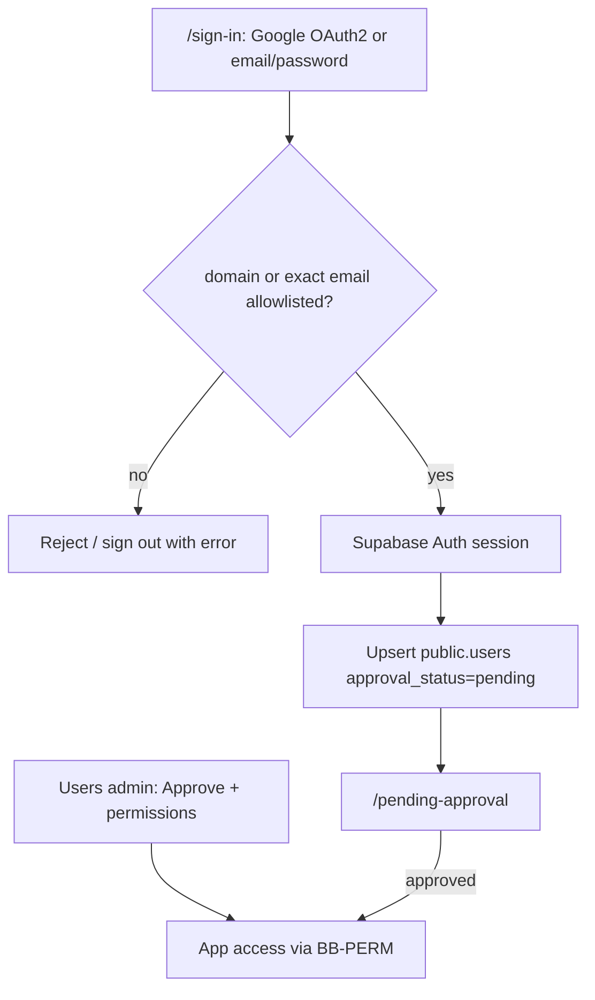

# Google OAuth2 + Self-Signup + Admin Approval — Design Spec

**Date:** 2026-07-12  
**Status:** Approved for planning  
**Branch:** `feat/auth-google-approval`  
**Scope:** Website self-registration with Google OAuth2 + email/password; domain/email allowlist; pending-approval gate; admin approve with permissions  
**Depends on:** Supabase Auth + BB-PERM (`docs/superpowers/specs/2026-07-12-supabase-auth-bb-perm-design.md`)  
**Approach:** Momus Supabase Auth only (Google as OAuth2 IdP) — Approach 1

## Goal

Let people join Momus from the website (Google or email/password) without using the Supabase Dashboard for day-to-day user creation. Registration is limited by an allowlist (domains **or** exact emails). New accounts stay **pending** until a `manage_users` admin approves them and assigns permissions. No Clerk/Auth0 or other identity vendors.

## Non-goals

- Hand-rolled OAuth2 outside Supabase Auth
- Additional IdPs (Microsoft, GitHub) unless added later
- Magic link/OTP as a primary path (may remain unused in Auth config)
- DEV-9 Vault, Inngest, migration workstreams
- Removing the optional admin **invite** shortcut (keep as pre-approve path)

## Decisions

| Topic | Choice |
|---|---|
| Auth host | Momus Supabase project `sdzoovwjcjqjgfoqszpf` only |
| Sign-in methods | Google OAuth2 + email/password |
| Google role | OAuth 2.0 IdP via Supabase Auth Google provider |
| Post-signup access | Sign in allowed; only `/pending-approval` until approved |
| Approval | Admin picks permissions (default `view_analytics` checked) |
| Allowlist | Domain **or** exact email (both) |
| Allowlist storage | Momus DB; edited by `manage_users` |
| Seed domain | `allofresh.id` |
| Status model | Explicit `approval_status`: `pending \| approved \| rejected` |
| Soft deactivate | Keep via `is_candidate` and/or `rejected` (see below) |

## Architecture



### Session resolution (extends existing `getSessionUser`)

1. Validate Supabase session (`auth.getUser()`).
2. Load/create `public.users` linked by `auth_user_id` (and email).
3. If email not allowlisted at first link → do not create approved access; sign out + error.
4. If `approval_status = pending` → treat as authenticated-but-gated (middleware routes to pending page; APIs return 403 pending).
5. If `approval_status = approved` and not soft-deactivated → load `user_permissions` (existing BB-PERM).
6. If `rejected` or soft-deactivated candidate → deny app access.

### Middleware public / gated paths

| Path class | Who |
|---|---|
| Public | `/sign-in`, `/auth/callback`, `/api/health*`, `/api/inngest`, static |
| Pending-only | `/pending-approval`, sign-out |
| Approved app | All other pages/APIs (existing permission checks) |

## Sign-in UX

**`/sign-in`**
- Primary CTA: **Continue with Google** → `signInWithOAuth({ provider: 'google', options: { redirectTo: origin + '/auth/callback' } })`
- Secondary: email + password (sign-in and sign-up)
- After success: ensure Momus user; route by status (`pending` → `/pending-approval`, `approved` → `next` or `/`)
- Clear errors for: not allowlisted, rejected, auth failure

**`/pending-approval`**
- Message that an admin must approve access
- Sign out button only (no app nav)

## Allowlist

Stored in Momus Postgres (preferred dedicated tables):

- `auth_allowed_domains (domain text primary key, created_at, created_by)`
- `auth_allowed_emails (email text primary key, created_at, created_by)`

**Rule:** allow if `split_part(lower(email),'@',2)` ∈ domains **OR** `lower(email)` ∈ emails.

Seed migration: insert domain `allofresh.id`.

Checked:
- On email/password sign-up
- On first Google account link / ensure-user
- Optionally re-checked on login (recommended: re-check; if removed from allowlist while pending, keep pending but block approve; if approved and removed, do not auto-revoke in v1 — document; admin soft-deactivates manually)

## Users admin

Enhance `/settings/users` (`manage_users`):

| Section | Behavior |
|---|---|
| Pending | List pending users; **Approve** opens dialog with permission checkboxes (default `view_analytics`); **Reject** sets `rejected` |
| Active | Existing list/edit permissions / soft deactivate |
| Allowlist | Add/remove domains and exact emails |
| Invite (optional) | Existing invite = create Auth user + can set `approved` immediately with chosen permissions |

## Data model

Migration on `public.users`:

```sql
ALTER TABLE public.users
  ADD COLUMN IF NOT EXISTS approval_status TEXT NOT NULL DEFAULT 'approved'
  CHECK (approval_status IN ('pending', 'approved', 'rejected'));
```

Backfill: existing users (including seeded admin) → `approved`.  
New self-serve signups → `pending` with empty permissions.  
`is_candidate = true` remains for soft-deactivate of previously approved users (or map deactivate → `rejected` + clear permissions — pick one in plan; prefer: deactivate sets `is_candidate=true` and clears permissions, leaves `approval_status=approved` historically, OR deactivate sets `rejected`. **Recommendation:** soft deactivate → `is_candidate=true`, clear permissions; reject pending → `approval_status=rejected`).

## APIs

| Method | Path | Auth | Notes |
|---|---|---|---|
| POST | `/api/auth/ensure-user` | session | Idempotent upsert pending/approved link after login; enforce allowlist |
| GET | `/api/users?status=pending\|approved` | `manage_users` | Filter list |
| POST | `/api/users/[id]/approve` | `manage_users` + CSRF | Body `{ permissions: string[] }`; default validate like `normalizePermissions` |
| POST | `/api/users/[id]/reject` | `manage_users` + CSRF | Sets `rejected` |
| GET/PUT | `/api/settings/auth-allowlist` | `manage_users` + CSRF on PUT | Domains + emails |

Email/password sign-up uses browser `signUp` then `ensure-user`. Google uses callback then `ensure-user`.

## Ops (Momus project only)

1. Supabase Dashboard → Auth → Providers → **Google**: enable; paste Google Cloud OAuth Client ID/Secret (OAuth 2.0).
2. Redirect URLs: `https://momus.vercel.app/auth/callback`, preview `https://*-*.vercel.app/auth/callback`, local `http://localhost:3000/auth/callback`.
3. Site URL = production Momus URL.
4. No production `MOMUS_DEV_AUTH_BYPASS`.
5. Update `docs/ops/supabase-auth-bootstrap.md` with Google + allowlist + approval steps.

## Errors

| Case | Behavior |
|---|---|
| Not allowlisted | Sign-up/link rejected; message to contact admin |
| Pending | Redirect `/pending-approval`; APIs 403 `Pending approval` |
| Rejected | Sign-in error / blocked screen |
| Missing permission | Existing 403 |

## Testing

- Unit: allowlist matcher (domain + email); approval status gating helper
- API: ensure-user allow/deny; approve/reject; allowlist CRUD
- Manual: Google login allowlisted → pending → admin approve → app; non-allowlisted Google rejected; password sign-up same; allowlist edit in UI

## Acceptance

- [ ] Google OAuth2 sign-in works via Momus Supabase only
- [ ] Email/password registration from the website
- [ ] Non-allowlisted emails cannot get a pending Momus user
- [ ] Pending users only see pending screen
- [ ] Admin can approve with chosen permissions (default `view_analytics`)
- [ ] Admin can manage domain + email allowlists in-app
- [ ] No dependency on Supabase Dashboard for routine user creation

## Follow-on

Unchanged later workstreams: Vault, Inngest, scheduler/retention, migration.
