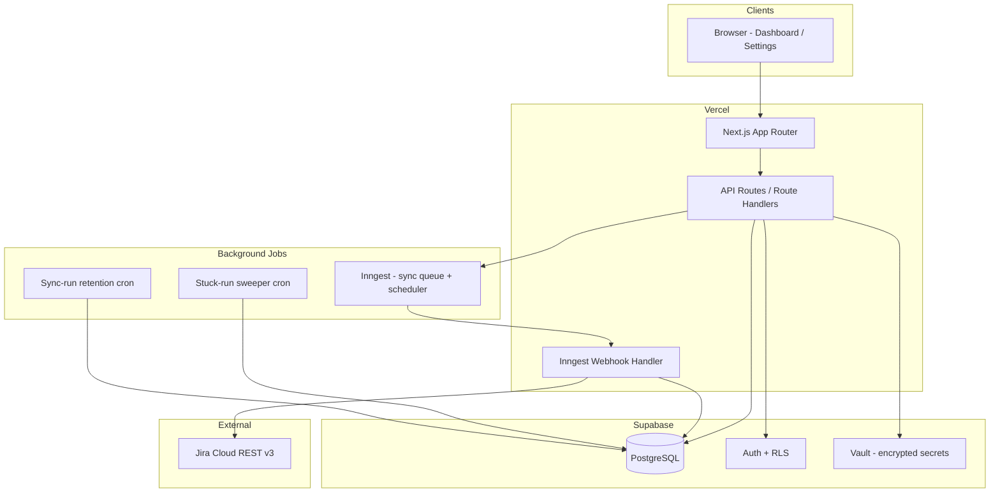

# Momus — Bug Budget Module Implementation Plan

> **For agentic workers:** REQUIRED SUB-SKILL: Use superpowers:subagent-driven-development (recommended) or superpowers:executing-plans to implement this plan task-by-task. Steps use checkbox (`- [ ]`) syntax for tracking.

**Goal:** Rebuild the QARATMS Bug Budget module (`/bug-budget`) on a modern JavaScript stack with behavioral parity to the legacy PHP system, zero data loss on migration, and production deployment on Vercel + Supabase.

**Architecture:** A Next.js (App Router) monorepo serves the dashboard, settings UI, and REST API on Vercel. Supabase PostgreSQL holds the denormalized `bug_budget` mirror and shared settings tables. Long-running Jira sync jobs run via Inngest (Vercel-compatible queue) with a minutely scheduler tick. Business logic lives in shared TypeScript packages consumed by API routes, workers, and tests.

**Tech Stack:** TypeScript, Next.js 15, React 19, Supabase (PostgreSQL + Auth + Vault), Inngest, Zod, Vitest, Playwright, Docker Compose, Vercel, Tailwind CSS + shadcn/ui (Bootstrap 5 token parity).

---

## Table of Contents

1. [Executive Summary](#1-executive-summary)
2. [Architecture](#2-architecture)
3. [Project Structure](#3-project-structure)
4. [Open Questions — Decisions Required](#4-open-questions--decisions-required)
5. [Development Phases](#5-development-phases)
6. [Milestones & Deliverables](#6-milestones--deliverables)
7. [Assumptions](#7-assumptions)
8. [Risks & Mitigations](#8-risks--mitigations)
9. [Docker & Local Development](#9-docker--local-development)
10. [Vercel Deployment](#10-vercel-deployment)
11. [Supabase Integration](#11-supabase-integration)
12. [Migration & Cutover](#12-migration--cutover)
13. [Testing Strategy](#13-testing-strategy)
14. [Operations Runbook](#14-operations-runbook)
15. [Requirement Traceability](#15-requirement-traceability)

---

## 1. Executive Summary

Momus is a centralized bug and defect tracking system governing quality debt via the **Bug Budget** model: each squad project receives a point budget (default 100); open bugs/defects consume budget based on priority × severity multipliers; remaining budget drives traffic-light status from "Safe" to "Drop product initiative and Fix the debt."

The rebuild targets **behavioral parity** with the legacy QARATMS module (PRD v1.1), verified via golden fixtures (Appendix A), acceptance criteria (§15), and a parallel-run validation window.

**Scope (in):** Dashboard, detail page, settings tab, Jira sync, cron scheduling, CSV export, summary modals, permissions, caching, migration.

**Scope (out):** Write-back to Jira, sibling modules (Defect Analytics, Defect Tracker, Leaderboard, Performance) except as downstream consumers of `bug_budget` table semantics.

---

## 2. Architecture

### 2.1 High-Level Diagram



### 2.2 Layer Responsibilities

| Layer | Responsibility |
|---|---|
| **Presentation** (`apps/web`) | Dashboard, detail page, settings tab; client-side filters/AJAX; Bootstrap-token-compatible UI |
| **API** (`apps/web/app/api`) | REST endpoints per PRD §8; auth middleware; input validation |
| **Domain** (`packages/domain`) | Cost/budget formulas, age calculation, Jira transform, filter builders — pure functions |
| **Infrastructure** (`packages/infra`) | Supabase client, Jira HTTP client, cache adapter, encryption helpers |
| **Jobs** (`packages/jobs`) | Sync orchestration, progress updates, orphan cleanup, cache flush |
| **Database** (`supabase/migrations`) | Schema, indexes, RLS policies, seed data |

### 2.3 Key Architectural Decisions

| Decision | Choice | Rationale |
|---|---|---|
| Runtime | Node.js 22 LTS | Vercel default; full Jira SDK compatibility |
| Framework | Next.js App Router | SSR + API routes on single Vercel project |
| Database | Supabase PostgreSQL | Managed Postgres, migrations, RLS, Vault for token encryption |
| Auth | Supabase Auth + custom permissions | Map `view_analytics`, `access_settings`, `manage_users` via `user_permissions` table |
| Background jobs | Inngest | Vercel-native; supports 15+ min steps, retries, concurrency guards |
| Scheduler | Inngest cron (minutely tick) | Replaces legacy `cron_schedules` minutely tick + queue worker |
| Caching | Upstash Redis (optional) or in-memory + DB version counter | PRD §13 cache keys; version bump on sync |
| UI library | Tailwind + shadcn/ui | Reproduce Bootstrap 5 design tokens (§9.6) without Bootstrap dependency |
| Monorepo | Turborepo + pnpm workspaces | Shared packages between web, jobs, tests |

### 2.4 Vercel Constraint: Long-Running Sync

Legacy sync runs up to 1200 s with batch pagination. Vercel serverless functions cap at 300 s (Pro). **Solution:** Inngest step functions — each Jira page (≤100 issues) is one step; progress persisted to `bug_budget_sync_runs` between steps. Manual sync returns `{queued: true, sync_run_id}` immediately (BB-SYNC-06).

### 2.5 Downstream Consumer Contract

The `bug_budget` table name, column names, and semantics (`is_open`, `defect_age_days`, `final_issue_type`, JSON encodings) must remain stable per BB-DATA-07/08. No schema rename without coordinated consumer migration.

---

## 3. Project Structure

```
Momus/
├── apps/
│   └── web/                          # Next.js application (Vercel)
│       ├── app/
│       │   ├── (auth)/               # Authenticated layout + sidebar nav
│       │   ├── bug-budget/           # Dashboard + detail pages
│       │   ├── settings/atlassian/   # Settings tab (#bug-budget)
│       │   └── api/                  # REST API route handlers
│       │       ├── bug-budget/
│       │       └── settings/bug-budget/
│       ├── components/               # UI components
│       ├── hooks/                    # Client hooks (filters, sync polling)
│       ├── lib/                      # App-specific utilities
│       └── public/
├── packages/
│   ├── domain/                       # Pure business logic
│   │   ├── budget/                   # Cost, budget, status thresholds
│   │   ├── sync/                     # Jira transform, JQL builders
│   │   ├── filters/                  # Query param → SQL filters
│   │   ├── age/                      # Business-day calculator
│   │   └── constants/                # Enumerations (§4.6)
│   ├── infra/                        # External integrations
│   │   ├── supabase/                 # Typed client, repositories
│   │   ├── jira/                     # Jira REST v3 client
│   │   ├── cache/                    # Cache adapter
│   │   └── crypto/                   # Token encryption (Supabase Vault)
│   ├── jobs/                         # Inngest functions
│   │   ├── sync-bug-budget.ts
│   │   ├── scheduler-tick.ts
│   │   ├── stuck-run-sweeper.ts
│   │   └── retention-prune.ts
│   └── shared/                       # Types, Zod schemas, message catalog
│       ├── schemas/
│       ├── types/
│       └── messages.ts               # Appendix B verbatim
├── supabase/
│   ├── migrations/                   # SQL migrations
│   ├── seed/                         # Dev seed data + golden fixtures
│   └── config.toml
├── tests/
│   ├── unit/                         # Vitest — domain logic
│   ├── integration/                  # API + DB tests
│   ├── fixtures/                     # Appendix A golden data
│   └── e2e/                          # Playwright
├── docker/
│   ├── Dockerfile.web
│   ├── Dockerfile.worker             # Local Inngest dev server
│   └── docker-compose.yml
├── .cursor/rules/                    # Agent + dev conventions
├── conventions.md                    # Human-readable JS standards
├── plan.md                           # This document
├── history-log.md                    # Implementation changelog
├── prd.md                            # Product requirements (source of truth)
├── turbo.json
├── package.json
└── pnpm-workspace.yaml
```

---

## 4. Open Questions — Decisions Required

Resolve before Phase 2 implementation begins (PRD §16.3):

| ID | Question | Recommended | Status |
|---|---|---|---|
| OQ-1 | Default JQL year scope | **(a)** Rolling current calendar year at runtime | ⏳ Pending sign-off |
| OQ-2 | Multiplier retroactive repricing | **(a)** Accept read-time repricing for parity | ⏳ Pending sign-off |
| OQ-3 | Internal detail page | **(a)** Keep as direct-URL/debug page | ⏳ Pending sign-off |
| OQ-4 | `GET /api/bug-budget/stats` | **(b)** Drop unless consumer found in BB-DATA-08 inventory | ⏳ Pending inventory |
| OQ-5 | `raw_jira_data` retention | **(a)** Keep indefinitely | ✅ Aligned with PRD |
| OQ-6 | Budget legend granularity | **(a)** Keep cosmetic split (25-50 / 51-85 both "warning") | ⏳ Pending QA sign-off |

**Recommended deviations** (PRD §16.2) — sign-off before build:

| ID | Change | Priority |
|---|---|---|
| DEV-1 | DB-backed multipliers/budgets (not config files) | Must |
| DEV-2 | Structured scope settings (not JQL regex parse) | Must |
| DEV-3 | Data-driven Indonesian holiday calendar | Must |
| DEV-4 | Configurable QA-checker name list | Should |
| DEV-5 | Configurable Jira custom-field mapping | Must |
| DEV-8 | 409 concurrency guard on active sync | Must |
| DEV-9 | Encrypt Jira API token at rest (Supabase Vault) | Must |
| DEV-10 | Audit log for settings changes | Should |

---

## 5. Development Phases

### Phase 0 — Foundation (Week 1–2)

**Objective:** Runnable monorepo, database schema, Docker local env, CI pipeline.

- [ ] Initialize Turborepo monorepo with pnpm workspaces
- [ ] Configure TypeScript strict mode, ESLint, Prettier, Husky pre-commit
- [ ] Create Supabase project; define migrations for:
  - `bug_budget` (83 columns + indexes per BB-DATA-01/02)
  - `bug_budget_sync_runs` (BB-DATA-03)
  - `cron_schedules` (BB-DATA-04)
  - `settings` (BB-DATA-05)
  - `audit_logs`, `user_permissions`, `indonesian_holidays`
  - `bug_budget_config` (multipliers, project budgets, mappings, exclusions — DEV-1)
- [ ] Docker Compose: web app, Supabase local, Inngest dev server
- [ ] Seed golden fixture data (Appendix A.1, A.2, A.3)
- [ ] GitHub Actions: lint, typecheck, unit tests on PR

**Exit criteria:** `docker compose up` starts all services; migrations apply cleanly; empty dashboard renders.

---

### Phase 1 — Domain Logic (Week 2–3)

**Objective:** Pure TypeScript implementations of all business rules with golden-fixture tests.

- [ ] **Cost calculator** (BB-CALC-01): priority × severity multipliers, null → 1 fallback
- [ ] **Budget calculator** (BB-CALC-02/03/04): project mapping, remaining budget, status thresholds, sort order
- [ ] **Open/closed logic** (BB-CALC-05): status category evaluation
- [ ] **Age calculator** (BB-CALC-06/07): business days, Indonesia holidays, pre-2024 sprint fallback, buckets
- [ ] **Jira transform** (BB-SYNC-04): full field mapping including custom fields (DEV-5 configurable)
- [ ] **JQL builders** (BB-SCOPE-01/02/03): default scope, range generators, structured exclusions (DEV-2)
- [ ] **Filter builder** (BB-API-03): all query params → SQL conditions
- [ ] **Stats aggregator** (BB-API-04): stat cards + severity breakdown
- [ ] **Summary builder** (BB-API-05): open bug/defect summary project objects
- [ ] **AC-related label inference** (§7.4)
- [ ] **Badge color mappers** (BB-UI-01)

**Exit criteria:** All Appendix A fixtures pass in Vitest; 100% coverage on `packages/domain`.

---

### Phase 2 — Jira Integration & Sync (Week 3–5)

**Objective:** End-to-end Jira sync with progress tracking and concurrency guards.

- [x] Jira REST v3 client: search/jql pagination, approximate-count, identity test (BB-SYNC-01)
- [ ] Settings service: credential storage via Supabase Vault (DEV-9), masked token handling
- [x] Sync orchestrator (BB-SYNC-05):
  - Upsert on `jira_key`
  - Per-page progress callback
  - Orphan cleanup (date-filter guard + cap guard per BB-EDGE-10)
  - Error collection without abort
  - 429 Retry-After handling (BB-EDGE-08)
- [x] Inngest functions:
  - `bug-budget/sync` — main sync job (BB-SYNC-06)
  - Concurrency guard: reject 409 if active run (BB-SYNC-09)
  - Stuck-run sweeper: mark `running` > 2× timeout as `failed` (BB-NFR-05)
- [x] Sync run repository: CRUD + progress updates (percentage ≤ 95 until complete)
- [x] Cache flush on sync completion (BB-CACHE-01)
- [x] API routes (BB-API-06):
  - `POST /settings/bug-budget/test-connection`
  - `POST /settings/bug-budget/get-issue-count`
  - `POST /settings/bug-budget/fetch-from-jira` (preview only)
  - `POST /settings/bug-budget/sync-with-progress`
  - `GET /settings/bug-budget/sync-status/{id}` (BB-PERM-02)
  - `POST /settings/bug-budget/save-multipliers`
  - `POST /settings/bug-budget/save-project-settings`
  - `GET|POST /settings/bug-budget/cron-schedule`

**Exit criteria:** Manual sync against Jira sandbox completes with progress polling; golden transform fixture matches; 409 on concurrent sync.

---

### Phase 3 — API & Data Access (Week 4–5)

**Objective:** Dashboard and summary REST endpoints with filtering, pagination, caching.

- [x] Repository layer: typed Supabase queries for `bug_budget`
- [x] `GET /api/bug-budget/open-bug-summary` (BB-API-02)
- [x] `GET /api/bug-budget/open-defect-summary`
- [x] Dashboard data endpoint with filters (BB-API-03), stats (BB-API-04), pagination
- [x] `GET /bug-budget/export/csv` — streaming CSV with computed cost (fix D-1)
- [ ] Cache layer: filter options (1800s), summaries (300s), version bump
- [x] Permission middleware (BB-PERM-01/02/03) — stub via `requirePermission`
- [x] Standardized error responses (BB-API-01) — `{success, message}` helpers

**Exit criteria:** Filter fixture A.3 passes; summary fixture A.2 passes; CSV headers aligned with computed cost.

---

### Phase 4 — Frontend UI (Week 5–7)

**Objective:** Dashboard, modals, settings tab with UX parity.

- [ ] App shell: sidebar nav (Bug Budget under Analytics group, BB-PERM-03)
- [ ] Dashboard page (BB-UI-02):
  - Header with action buttons
  - Six stat cards (BB-UI-03) with click-to-filter
  - Severity breakdown panel with AC detail collapse
  - Filter panel (BB-UI-04) with debounced AJAX + pushState
  - Issues table (BB-UI-05/06) with column visibility, pagination
  - Scope banner (M-01)
- [ ] Summary modals (BB-UI-07): fullscreen, year select, project cards, severity tables
- [ ] Detail page (BB-UI-08): read-only issue view with raw Jira JSON
- [ ] Settings tab (BB-UI-09):
  - Connection status card
  - JQL configuration + sync type selectors
  - Sync progress with 2s polling (BB-SYNC-08)
  - Project budget & mapping editor
  - Cost multiplier inputs
  - Cron schedule form
  - Sync activity log (last 7 days)
- [ ] Component states: loading/empty/error/success per BB-UI-11
- [ ] Design tokens (BB-UI-12): reproduce Bootstrap 5 hex values
- [ ] Message catalog (Appendix B) — verbatim copy
- [ ] Accessibility basics (BB-UI-13): keyboard nav, badge text labels

**Exit criteria:** Visual parity review with QA; all M-01–M-20 messages present; AJAX filter/back-forward works.

---

### Phase 5 — Scheduling & Operations (Week 7–8)

**Objective:** Automated sync, retention, audit, health checks.

- [ ] Inngest cron: minutely scheduler tick reading `cron_schedules` (BB-SCHED-01/02)
- [ ] Schedule row `bug_budget_sync`: default inactive, command_params for JQL
- [ ] `next_run_at` recomputation on save
- [ ] Sync-run retention: 180 days or 500 runs (BB-LIFE-02)
- [ ] Audit logging for settings changes (DEV-10, BB-LIFE-05)
- [ ] Health check endpoints: DB, Jira connectivity, Inngest worker status
- [ ] Structured logging: sync start/end, per-issue errors, settings changes
- [ ] Ops runbook documentation (§14)

**Exit criteria:** Scheduled sync fires at configured cadence; retention prunes old runs; audit entries created on settings save.

---

### Phase 6 — Migration & Validation (Week 8–10)

**Objective:** Data migration, parallel run, cutover readiness.

- [ ] Migration scripts (BB-MIG-01):
  - Bulk copy `bug_budget`, `bug_budget_sync_runs`, `cron_schedules` row
  - Settings migration (BB-MIG-03): multipliers/budgets → DB; manual token re-entry
- [ ] Reconciliation checks (BB-MIG-02): count, per-year counts, checksum
- [ ] Downstream consumer inventory (BB-DATA-08): grep-based dependency report
- [ ] Parallel run tooling (BB-MIG-04): daily diff of summaries, counts, CSV
- [ ] Rollback plan (BB-MIG-06): 30-day read-only legacy standby
- [ ] Fix known defects D-1 through D-6 in rebuild

**Exit criteria:** AC-1 through AC-10 pass; parallel-run zero unexplained differences for 1–2 weeks.

---

### Phase 7 — Production Deployment (Week 10–11)

**Objective:** Vercel + Supabase production deployment with monitoring.

- [ ] Vercel project configuration (§10)
- [ ] Supabase production instance with RLS policies
- [ ] Environment variables and secrets management
- [ ] Inngest production app registration
- [ ] Performance validation against BB-NFR-02 targets
- [ ] Security review: token encryption, CSRF, JQL injection prevention
- [ ] DNS/route cutover

**Exit criteria:** Production dashboard live; sync operational; monitoring alerts configured.

---

## 6. Milestones & Deliverables

| Milestone | Target | Deliverables | Acceptance |
|---|---|---|---|
| **M0: Scaffold** | Week 2 | Monorepo, schema, Docker, CI | `docker compose up` works |
| **M1: Domain Parity** | Week 3 | `packages/domain` + fixture tests | Appendix A tests green |
| **M2: Sync Pipeline** | Week 5 | Jira sync + Inngest jobs | Manual sync end-to-end |
| **M3: API Complete** | Week 5 | All §8 endpoints | Postman/contract tests pass |
| **M4: UI Parity** | Week 7 | Dashboard + settings | QA visual review |
| **M5: Ops Ready** | Week 8 | Scheduler, retention, audit | BB-SCHED, BB-LIFE met |
| **M6: Migration Validated** | Week 10 | Data migrated, parallel run clean | BB-MIG criteria met |
| **M7: Production** | Week 11 | Vercel + Supabase live | §0.5 success metrics |

---

## 7. Assumptions

1. **Jira instance** remains Allofresh Cloud (`allofresh.atlassian.net`) with existing custom field IDs (configurable per DEV-5).
2. **User authentication** is handled by the parent QARATMS platform; Momus receives authenticated sessions (JWT or shared auth middleware). Permission flags (`view_analytics`, `access_settings`, `manage_users`) are available via user profile or permissions table.
3. **Timezone** is Asia/Jakarta for all date math (BB-EDGE-11).
4. **Data volume** stays within BB-NFR-01 design capacity (50,000 issues).
5. **Downstream modules** remain on legacy stack during parallel run; they read the same PostgreSQL instance or a replicated view.
6. **No write-back to Jira** — integration is read-only (§0.4).
7. **English-only UI** — no i18n framework required (BB-NFR-06).
8. **Inngest** is approved for background job infrastructure on Vercel.
9. **QA team** available for parity verification against golden fixtures and visual review.

---

## 8. Risks & Mitigations

| Risk | Impact | Likelihood | Mitigation |
|---|---|---|---|
| Vercel function timeout on sync | High | Medium | Inngest step-per-page architecture; never run full sync in one serverless invocation |
| Jira rate limiting (429) | Medium | Medium | Retry-After honor; batch size cap; concurrency guard (BB-SYNC-09) |
| Data migration checksum mismatch | High | Low | Reconciliation scripts; parallel run before cutover |
| Downstream consumer regression | High | Medium | BB-DATA-08 inventory; stable table contract; coordinated release |
| Holiday table gaps (2026+) | Medium | High | DEV-3 data-driven calendar; seed 2024–2027; admin UI for future years |
| Multiplier repricing confusion | Low | Medium | Document OQ-2 decision; consider snapshotting in future iteration |
| Inngest vendor dependency | Medium | Low | Job logic isolated in `packages/jobs`; adapter pattern for alternative runners |
| `raw_jira_data` storage growth | Low | Low | Monitor table size; BB-NFR-01 headroom (~5 GB at capacity) |
| Permission model mismatch with parent auth | High | Medium | Early spike on auth integration in Phase 0 |
| Hardcoded JQL year stale every January | Medium | High | Resolve OQ-1 with rolling year before Phase 2 |

---

## 9. Docker & Local Development

### 9.1 Services

```yaml
# docker-compose.yml (conceptual)
services:
  web:
    build: ./docker/Dockerfile.web
    ports: ["3000:3000"]
    env_file: .env.local
    depends_on: [supabase-db]

  supabase-db:
    image: supabase/postgres:15
    ports: ["54322:5432"]
    volumes: [supabase-data:/var/lib/postgresql/data]

  supabase-studio:
    image: supabase/studio
    ports: ["54323:3000"]

  inngest-dev:
    image: inngest/inngest
    ports: ["8288:8288"]
    command: ["inngest", "dev", "-u", "http://web:3000/api/inngest"]
```

### 9.2 Developer Workflow

```bash
# First-time setup
cp .env.example .env.local
docker compose up -d          # Start Supabase + Inngest dev
pnpm install
pnpm db:migrate               # Apply Supabase migrations
pnpm db:seed                  # Golden fixtures + dev settings
pnpm dev                      # Next.js on :3000

# Run tests
pnpm test                     # Vitest unit tests
pnpm test:integration         # API + DB integration
pnpm test:e2e                 # Playwright
```

### 9.3 Environment Variables

| Variable | Purpose |
|---|---|
| `NEXT_PUBLIC_SUPABASE_URL` | Supabase project URL |
| `NEXT_PUBLIC_SUPABASE_ANON_KEY` | Client-side auth |
| `SUPABASE_SERVICE_ROLE_KEY` | Server-side DB access |
| `INNGEST_EVENT_KEY` | Inngest authentication |
| `INNGEST_SIGNING_KEY` | Webhook verification |
| `JIRA_URL` | Fallback Jira site URL |
| `JIRA_USERNAME` | Fallback Jira email |
| `JIRA_API_TOKEN` | Fallback token (dev only; prod uses Vault) |
| `TZ` | `Asia/Jakarta` |

---

## 10. Vercel Deployment

### 10.1 Project Configuration

| Setting | Value |
|---|---|
| Framework | Next.js |
| Node.js version | 22.x |
| Root directory | `apps/web` |
| Build command | `cd ../.. && pnpm turbo build --filter=web` |
| Install command | `pnpm install` |
| Output | Default (.next) |

### 10.2 Vercel Features Used

- **Serverless Functions:** API route handlers for REST endpoints
- **Cron Jobs:** Stuck-run sweeper (every 15 min), retention prune (daily)
- **Edge Middleware:** Auth session validation, permission checks
- **Environment Variables:** Per-environment (preview, production)
- **Inngest Integration:** Vercel marketplace integration for webhook route

### 10.3 Routes

| Route | Type | Max Duration |
|---|---|---|
| `/bug-budget/*` | SSR pages | Default |
| `/api/bug-budget/*` | API routes | 30s |
| `/api/settings/bug-budget/*` | API routes | 30s (sync returns immediately) |
| `/api/inngest` | Inngest webhook | 300s |
| `/api/bug-budget/export/csv` | Streaming | 300s |

### 10.4 Deployment Pipeline

```
PR → Vercel Preview → CI tests → QA review
main → Vercel Production → smoke tests → monitoring
```

---

## 11. Supabase Integration

### 11.1 Schema Strategy

- Migrations in `supabase/migrations/` managed via Supabase CLI
- All tables in `public` schema for downstream consumer compatibility
- Row Level Security enabled; service role for sync jobs, authenticated role for reads

### 11.2 Key Tables (Beyond PRD)

| Table | Purpose |
|---|---|
| `bug_budget_config` | Multipliers, project budgets, mappings, exclusions (DEV-1) |
| `jira_field_mappings` | Custom field ID → column mapping (DEV-5) |
| `indonesian_holidays` | Date-driven holiday calendar (DEV-3) |
| `qa_checker_names` | Configurable QA name list (DEV-4) |
| `user_permissions` | `view_analytics`, `access_settings`, `manage_users` flags |
| `audit_logs` | Settings change audit trail (DEV-10) |

### 11.3 Supabase Vault

Jira API token stored encrypted:

```sql
-- Conceptual: settings reference vault secret ID, not plaintext
INSERT INTO settings (key, value, type, "group")
VALUES ('jira_api_token', vault.create_secret('actual-token'), 'secret', 'jira');
```

### 11.4 Realtime (Optional)

Sync progress polling uses REST (2s interval per BB-SYNC-08). Supabase Realtime on `bug_budget_sync_runs` is a future optimization (Could priority).

---

## 12. Migration & Cutover

Per PRD §14 (BB-MIG-01 through BB-MIG-06):

### 12.1 Pre-Cutover Checklist

- [ ] Bulk copy `bug_budget` (all rows, JSON columns intact)
- [ ] Copy `bug_budget_sync_runs` (audit trail)
- [ ] Copy `cron_schedules` row `bug_budget_sync`
- [ ] Migrate settings keys (§4.5A) — token re-entered manually
- [ ] Migrate multipliers/budgets from PHP config → `bug_budget_config`
- [ ] Drop legacy `bug_budget_settings` table (D-4)
- [ ] Reconciliation: COUNT(*), per-year counts, checksum (`jira_key`, `updated_date`, `is_open`)

### 12.2 Parallel Run (1–2 Weeks)

Daily automated diff:
- Row counts by `created_year`
- Open Bug Summary JSON (current year + All Years)
- Open Defect Summary JSON
- One CSV export hash

### 12.3 Cutover

1. Enable Momus routes (DNS/route flip) — **Momus is sole SoT**
2. Account for every DATA-08 consumer (rebuild in Momus / move / retire) — see `docs/migration/bb-mig-05-downstream-cutover.md`
3. Keep QARATMS read-only but deployable for 30 days — `docs/migration/bb-mig-06-rollback.md`
4. Run incremental sync on Momus only
5. Monitor for 48 hours
6. After window: delete QARATMS app + MySQL (no compatibility view)

---

## 13. Testing Strategy

### 13.1 Test Pyramid

| Level | Tool | Coverage Target |
|---|---|---|
| Unit | Vitest | `packages/domain` — 100%; formulas, transforms, filters |
| Integration | Vitest + Supabase local | API routes, repositories, sync orchestrator |
| Contract | Vitest | Appendix A golden fixtures (normative) |
| E2E | Playwright | Dashboard filters, sync flow, settings save |
| Performance | k6 or Artillery | BB-NFR-02 targets at 50k seeded rows |

### 13.2 Golden Fixtures (Normative)

| Fixture | Verifies |
|---|---|
| A.1 Transform | BB-SYNC-04 field mapping |
| A.2 Summary | BB-CALC-01–06, BB-API-05 |
| A.3 Filters | BB-API-03, BB-SCOPE-01/02 |

### 13.3 Acceptance Criteria Mapping

All AC-1 through AC-10 (§15) must pass before production cutover.

---

## 14. Operations Runbook

### 14.1 Required Components

| Component | Platform | Health Check |
|---|---|---|
| Web app | Vercel | `GET /api/health` |
| Database | Supabase | Connection pool status |
| Background worker | Inngest | Dashboard + `GET /api/health/worker` |
| Scheduler | Inngest cron | Last tick timestamp in logs |
| Cache | Upstash Redis (if used) | Ping |

### 14.2 Common Operations

| Operation | Command / Action |
|---|---|
| Manual sync | Settings → Sync with Database |
| Full reconciliation sync | Use JQL without date filter (BB-EDGE-01) |
| Check stuck runs | Sweeper auto-marks; manual: query `status=running AND started_at < now() - 40min` |
| Rotate Jira token | Settings → Atlassian → update token |
| Add holiday | Admin: insert into `indonesian_holidays` |
| Rollback | DNS flip to legacy; consumers re-point |

### 14.3 Monitoring Alerts

- Sync failure rate > 2 in 24h
- Stuck run detected
- Jira 429 rate spike
- Dashboard p95 > 1.5s
- DB connection errors

---

## 15. Requirement Traceability

| PRD Section | Plan Phase | Key Deliverable |
|---|---|---|
| §3 Permissions | Phase 3 | Auth middleware + RLS |
| §4 Data model | Phase 0 | Supabase migrations |
| §5 JQL scope | Phase 1 | JQL builders |
| §6 Business rules | Phase 1 | `packages/domain` |
| §7 Jira sync | Phase 2 | Sync orchestrator + Inngest |
| §8 HTTP API | Phase 3 | API route handlers |
| §9 UI | Phase 4 | Next.js pages + components |
| §10 Edge cases | Phase 1–2 | Domain + sync guards |
| §11 NFRs | Phase 7 | Performance + security validation |
| §12 Lifecycle | Phase 5 | Retention + audit |
| §13 Caching | Phase 3 | Cache adapter |
| §14 Migration | Phase 6 | Migration scripts + parallel run |
| §15 Acceptance | Phase 6–7 | Full AC test suite |
| §16 Defects | Phase 1–4 | D-1 through D-6 fixes |
| Appendix A | Phase 1 | Golden fixture tests |
| Appendix B | Phase 4 | Message catalog |

---

*Plan version: 1.0 — 2026-07-11*
*Source PRD: v1.1 — 2026-07-11*
*Next review: After OQ-1 through OQ-6 sign-off*
