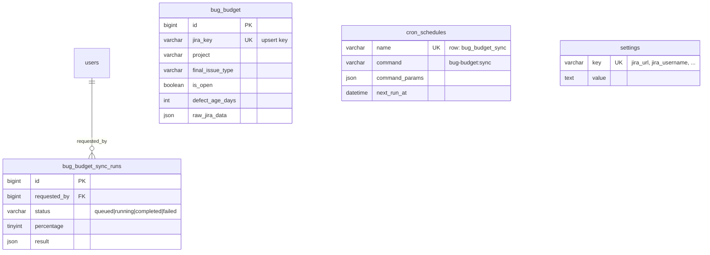
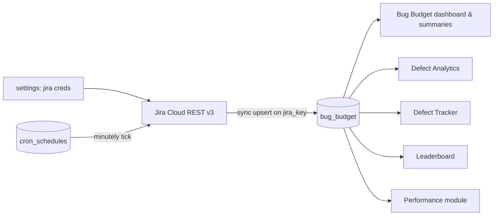
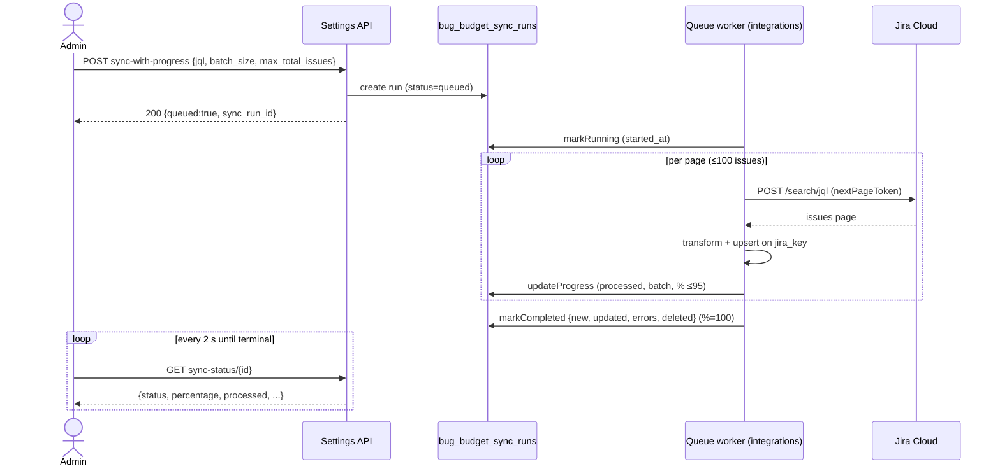

# PRD — Bug Budget Module

| | |
|---|---|
| **Product** | QARATMS — Bug Budget (`/bug-budget`) |
| **Document status** | Draft for review |
| **Version** | 1.1 |
| **Author** | Emile Francois (compiled with Claude Code from source at branch `checkpoint`) |
| **Source of truth as of** | 2026-07-10 |
| **Audience** | Team rebuilding this module on a new stack; QA verifying parity |

**Changelog**

| Version | Date | Changes |
|---|---|---|
| 1.0 | 2026-07-11 | Initial reverse-engineered spec (data model, business rules, API, UI). |
| 1.1 | 2026-07-11 | Added product context, glossary, permission matrix, ERD & sequence diagrams, data contract & consumers, concurrency rules, NFRs (with measured volumes), edge cases, lifecycle/privacy, migration plan, requirement IDs + traceability, golden fixtures, message catalog, design tokens; split defects vs. decisions vs. open questions. |

**How to read this document:** Normative requirements carry an ID (`BB-<area>-<nn>`) and a MoSCoW priority — **[M]** Must, **[S]** Should, **[C]** Could. Anything without an ID is context. §15 maps acceptance criteria to requirement IDs. §16 lists behaviors the rebuild must **not** replicate.

---

## 0. Product context

### 0.1 Problem statement

Engineering and QA leadership need a single, always-current answer to: *"Which squads' quality debt has grown past the point where they should stop shipping features and fix bugs?"* Raw Jira counts don't answer this — a project with 40 trivial bugs may be healthier than one with 3 critical ones. Bug Budget converts open bugs/defects into a weighted **cost**, subtracts it from a per-project **budget**, and turns the remainder into an unambiguous traffic-light instruction (from "Safe" to "Drop product initiative and Fix the debt").

### 0.2 Personas

| Persona | Primary use | Surfaces used |
|---|---|---|
| **QA Lead / Test Engineer** | Monitor open bugs per squad, drill into aging issues, chase assignees | Dashboard filters/table, summary modals |
| **Engineering Manager / Squad PIC** | Decide feature-vs-debt tradeoff from budget status; report in QBRs | Summary modals, CSV export |
| **QARATMS Administrator** | Keep Jira sync healthy; tune multipliers, budgets, schedules | Settings tab |
| **Downstream modules** (not human) | Defect Analytics, Defect Tracker, Leaderboard, Performance read the synced table | `bug_budget` table (§4.7) |

### 0.3 Goals of the rebuild

1. **Behavioral parity** — same numbers, same statuses, same filters, same export for the same input data (verified via §15 and Appendix A fixtures).
2. **Zero data loss** — all synced history and sync-run audit trail survive migration (§14).
3. **No retraining** — users find the same controls with the same labels and colors (§9, Appendix B).
4. **Deliberate divergence only** — the defects in §16.1 are fixed, not copied; deviations in §16.2 are signed off before build.

### 0.4 Non-goals

- No write-back to Jira (comments, transitions, field updates) — the integration is read-only.
- Not a defect triage/workflow tool — assignment and prioritization happen in Jira.
- No change to the budget model itself (formulas, thresholds) beyond the recorded defects.
- The sibling features sharing infrastructure (Jira History sync, Defect Analytics, Defect Tracker, Allure/GitLab tables created by the same migration) are **out of scope** except as consumers (§4.7).

### 0.5 Success metrics for the rebuild

| Metric | Target |
|---|---|
| §15 acceptance criteria passing | 100 % of [M] requirements |
| Appendix A golden fixtures | Byte-identical numeric outputs |
| Data migrated | 100 % of `bug_budget` rows reconciled (count + checksum on `jira_key`,`updated_date`) |
| Downstream modules (§4.7) | No regression in their existing outputs |
| Parallel-run divergence (§14.4) | 0 unexplained differences over the validation window |

---

## 1. Overview

Bug Budget tracks bug/defect issues synced from Jira Cloud and expresses product quality as a **budget**: every project starts with a budget (default **100** points), every open bug/defect consumes budget according to its priority × severity cost, and the remaining budget drives a traffic-light status per project.

The module has three surfaces:

1. **Dashboard** `GET /bug-budget` — filterable/sortable issue list with KPI stat cards, severity breakdown, Open Bug / Open Defect budget summary modals, CSV export.
2. **Detail page** `GET /bug-budget/{id}` — read-only view of a single synced issue.
3. **Settings tab** `/settings/atlassian#bug-budget` — Jira connection test, JQL/sync configuration, manual sync with live progress, cost multipliers, per-project budgets & name mappings, automated sync (cron) schedule.

Data flows one way: **Jira → sync → local `bug_budget` table → dashboard/summaries → downstream modules**. The app never writes back to Jira.

---

## 2. Glossary

| Term | Definition |
|---|---|
| **Budget** | Points allotted to a project (default 100). Consumed by the cost of its *open* issues. |
| **Cost** | Per-issue weight = priority multiplier × severity multiplier (§6.1). Computed at read time; never stored. |
| **Bug vs. Defect** | *Bug* = Jira issue type `Bug` (typically found in production/by users). *Defect* = types `Defect`, `Defect Sub-task`, `Defect Task` (typically found during testing). Summaries split on this. |
| **`issue_type` vs. `final_issue_type`** | Both are copied from Jira's issue type at sync. The dashboard filters on `issue_type`; the budget summaries filter on `final_issue_type`. They hold the same value today but are separate columns — a rebuild must keep both populated. |
| **Open** | Determined by Jira **status category**, not status: open unless the status category (lowercased) is `done`, `resolved`, or `closed` (§6.4). |
| **AC-related** | Issue traced to an Acceptance Criteria. Explicit Jira labels win; otherwise inferred (`*-inferred`, `*-inferred-from-type`) from issue type / summary keywords (§7.4). |
| **Business day** | Mon–Fri excluding Indonesian public holidays (holiday table currently hardcoded for 2024–2025 only — see §16.1). All ages are business-day based. |
| **Sync type** | How the sync JQL is built: `custom` (free JQL), `quarterly`, `monthly`, `yearly` (generated date ranges). |
| **Sync run** | One execution of a Jira→DB sync, tracked as a row in `bug_budget_sync_runs` with live progress. |
| **Excluded projects** | Jira projects filtered out of the default dashboard scope (internal/tooling projects). |
| **Display name / mapping** | Jira project keys map to squad display names (e.g. `AO` → `operation`); budgets are keyed by display name. |

---

## 3. Users, permissions & navigation

### 3.1 Permission matrix — **BB-PERM-01 [M]**

All routes require an authenticated, non-candidate user (`auth` + `block.candidates`).

| Capability | `view_analytics` | `access_settings` | `manage_users` |
|---|:---:|:---:|:---:|
| View dashboard `/bug-budget` | ✅ | — | — |
| View detail `/bug-budget/{id}` | ✅ | — | — |
| Export CSV | ✅ | — | — |
| Call stats / summary APIs | ✅ | — | — |
| See "Settings" button on dashboard | — | ✅ | — |
| Test connection, preview fetch, issue count | — | ✅ | — |
| Trigger sync | — | ✅ | — |
| Poll a sync run's status | own runs only | own runs only | ✅ any run |
| Save multipliers / project budgets & mappings | — | ✅ | — |
| Read/update cron schedule | — | ✅ | — |

**BB-PERM-02 [M]** — Sync-status polling returns 403 unless the requester created the run or holds `manage_users`.

### 3.2 Navigation — **BB-PERM-03 [S]**

Sidebar + header nav item "Bug Budget", icon `bi-bug`, under the **Analytics** group (menu key `bug_budget`, parent `analytics_dashboard`, sort order 2, between "Defect Analytics" and "Tracker Incomplete Field"). Visibility togglable via the Menu Visibility settings feature. Dashboard header shows a "Settings" button (→ `/settings/atlassian#bug-budget`) only for users with `access_settings`.

---

## 4. Data model

### 4.1 Entity relations



`bug_budget` intentionally has **no foreign keys** — it is a denormalized mirror of Jira issues. The only true relation is `bug_budget_sync_runs.requested_by → users.id`. `cron_schedules` and `settings` are shared app-wide tables; Bug Budget owns one schedule row and a handful of setting keys.

Data flow including consumers:



### 4.2 Table `bug_budget` — **BB-DATA-01 [M]**

Unique key: `jira_key`. All syncing is an upsert on `jira_key`.

| # | Column | Type | Null | Default | Notes |
|---|--------|------|------|---------|-------|
| 1 | `id` | bigint PK auto-inc | no | — | |
| 2 | `jira_key` | varchar(255) | no | — | **UNIQUE** |
| 3 | `project` | varchar(255) | no | — | Jira project key |
| 4 | `summary` | text | no | — | |
| 5 | `linked_issues` | text (JSON array) | yes | null | `[{key, type}]` |
| 6 | `has_linked_test_execution` | boolean | no | false | derived from linked issues |
| 7 | `tester_assignee` | varchar | yes | null | |
| 8 | `test_engineer_assignee` | varchar | yes | null | |
| 9 | `assignee` | varchar | yes | null | |
| 10 | `engineer_assignee` | varchar | yes | null | |
| 11 | `assignee_final` | varchar | yes | null | shown as "Assignee" in UI |
| 12 | `qa_checker` | varchar | yes | null | |
| 13 | `tested_by` | varchar | yes | null | shown as "Test Assignee" |
| 14 | `owner` | varchar | yes | null | |
| 15 | `reporter` | varchar | yes | null | |
| 16 | `creator` | varchar | yes | null | |
| 17 | `labels` | text (JSON array) | yes | null | |
| 18 | `status` | varchar | yes | null | |
| 19 | `issue_type` | varchar | yes | null | |
| 20 | `final_issue_type` | varchar | yes | null | used by summaries (see Glossary) |
| 21 | `priority` | varchar | yes | null | |
| 22 | `severity_issue` | varchar | yes | null | |
| 23 | `sprint` | varchar | yes | null | |
| 24 | `status_category` | varchar | yes | null | Jira status category |
| 25 | `status_category_changed` | datetime | yes | null | |
| 26 | `created_date` | datetime | yes | null | **indexed** |
| 27 | `start_date` | date | yes | null | |
| 28 | `begin_date` | date | yes | null | |
| 29 | `due_date` | date | yes | null | |
| 30 | `end_date` | date | yes | null | resolution date, "Closed" |
| 31 | `chart_date_first_response` | datetime | yes | null | |
| 32 | `actual_start` | datetime | yes | null | |
| 33 | `actual_end` | datetime | yes | null | |
| 34 | `last_synced_at` | datetime | yes | null | |
| 35 | `story_point_estimate` | decimal(8,2) | yes | null | |
| 36 | `story_points` | decimal(8,2) | yes | null | |
| 37 | `epic_link` | varchar | yes | null | |
| 38 | `epic_name` | varchar | yes | null | |
| 39 | `parent` | varchar | yes | null | |
| 40 | `parent_link` | varchar | yes | null | |
| 41 | `epic_level_epic` | varchar | yes | null | |
| 42 | `story_task_level_epic_name` | varchar | yes | null | always null today |
| 43 | `parent_epic_layer_2_key` | varchar | yes | null | always null today |
| 44 | `parent_epic_key` | varchar | yes | null | |
| 45 | `final_epic_name` | varchar | yes | null | |
| 46 | `linked_parent_epic_info` | text | yes | null | always null today |
| 47 | `pic_story_task_link_summary` | text | yes | null | always null today |
| 48 | `epic_task_story_name_summary` | text | yes | null | always null today |
| 49 | `components` | varchar (JSON array) | yes | null | |
| 50 | `fix_versions` | varchar (JSON array) | yes | null | |
| 51 | `is_open` | boolean | no | true | see §6.4 |
| 52 | `time_spent_seconds` | int | yes | null | |
| 53 | `progress_percentage` | decimal(5,2) | yes | null | always null today |
| 54 | `time_to_resolution_hours` | decimal(10,2) | yes | null | |
| 55 | `service_feature` | varchar | yes | null | |
| 56 | `service_feature_final` | varchar | yes | null | always null today |
| 57 | `created_year` | int | yes | null | **indexed** (composites) |
| 58 | `created_num_month` | int | yes | null | |
| 59 | `created_month_alpha` | varchar | yes | null | e.g. "March" |
| 60 | `first_response_month` | varchar | yes | null | |
| 61 | `closed_month` | varchar | yes | null | |
| 62 | `closed_year` | int | yes | null | |
| 63 | `closed_alpha_month` | varchar | yes | null | |
| 64 | `quarter` | varchar | yes | null | `"Q1 2026"`, **indexed** |
| 65 | `first_response_age_days` | int | yes | null | |
| 66 | `defect_age_days` | int | yes | null | business days, see §6.6 |
| 67 | `defect_age_bucket` | varchar | yes | null | fresh/aging/stale/long overdue |
| 68 | `defect_count` | int | yes | null | always 1 |
| 69 | `bug_count` | int | yes | null | 1 if Bug/Defect else 0 |
| 70 | `reports` | text | yes | null | = reporter |
| 71 | `pic_report` | text | yes | null | = reporter |
| 72 | `ac_related_labels` | text (JSON array) | yes | null | see §7.4 |
| 73 | `issue_level_type_layer_1` | varchar | yes | null | "Bug" or "Defect" |
| 74 | `issue_level_layer_2_type` | varchar | yes | null | always null today |
| 75 | `final_issue` | varchar | yes | null | = jira_key |
| 76 | `epic_final_issue_type` | varchar | yes | null | always null today |
| 77 | `real_project` | varchar | yes | null | = project |
| 78 | `bug_cost` | decimal(10,2) | yes | null | **never persisted** — see §6.1 & §16.1 |
| 79 | `raw_jira_data` | json | yes | null | full raw Jira issue payload (load-bearing, §12.2) |
| 80 | `updated_date` | datetime | yes | null | Jira `updated` |
| 81 | `resolved_date` | datetime | yes | null | Jira `resolutiondate` |
| 82 | `description` | text | yes | null | plain text (parsed from ADF) |
| 83 | `created_at` / `updated_at` | datetime | yes | null | row timestamps |

**Indexes — BB-DATA-02 [M]:** UNIQUE(`jira_key`); (`created_year`,`project`); (`created_year`,`is_open`); (`quarter`); (`created_date`); (`has_linked_test_execution`,`created_year`,`project`).

### 4.3 Table `bug_budget_sync_runs` — **BB-DATA-03 [M]**

| Column | Type | Null | Default |
|---|---|---|---|
| `id` | bigint PK | no | — |
| `requested_by` | bigint (→ users.id) | no | — |
| `sync_type` | varchar(32) | no | `custom` |
| `jql` | text | no | — |
| `batch_size` | smallint unsigned | no | 50 |
| `max_total_issues` | int unsigned | no | 0 |
| `status` | varchar(20) | no | `queued` |
| `total_issues` | int unsigned | no | 0 |
| `processed` | int unsigned | no | 0 |
| `current_batch` | smallint unsigned | no | 0 |
| `percentage` | tinyint | no | 0 |
| `result` | json | yes | null |
| `error_message` | text | yes | null |
| `started_at` / `completed_at` | datetime | yes | null |
| `created_at` / `updated_at` | datetime | yes | null |

Indexes: `requested_by`, `status`, (`status`,`created_at`).
**Status lifecycle:** `queued → running → completed | failed`. Percentage is capped at **95** during progress and set to **100** only on completion.
`result` JSON on completion: `{total_processed, new_issues, updated_issues, errors_count, jql_used, deleted_issues}`.

### 4.4 Table `cron_schedules` (shared scheduler; row `name='bug_budget_sync'`) — **BB-DATA-04 [M]**

| Column | Type | Null | Default |
|---|---|---|---|
| `id` | bigint PK | no | — |
| `name` | varchar UNIQUE | no | — |
| `command` | varchar | no | — (`bug-budget:sync`) |
| `schedule_type` | varchar | no | `daily` (daily/weekly/monthly/custom) |
| `interval_days` | int | no | 1 |
| `time` | varchar HH:MM | no | `00:00` |
| `day_of_week` | varchar | yes | null (monday…sunday) |
| `day_of_month` | int | yes | null (1–31) |
| `is_active` | boolean | no | true (created as **false** for bug_budget_sync) |
| `description` | text | yes | null |
| `command_params` | json | yes | null (`{jql, batch_size, max_total_issues}`) |
| `last_run_at` / `next_run_at` | datetime | yes | null |
| `last_run_result` | text | yes | null |
| `last_run_status` | varchar(20) | yes | null |
| timestamps | | | |

Indexes: UNIQUE(`name`), (`is_active`,`next_run_at`).

### 4.5 Settings storage — **BB-DATA-05 [M]** (three mechanisms today — consolidate per BB-MIG-03)

**A. Global `settings` table** (`key` UNIQUE, `value`, `type`, `group`, `description`) — the live source for the Jira connection:

| Key | Default / fallback | Meaning |
|---|---|---|
| `jira_url` | env `JIRA_URL` (`https://allofresh.atlassian.net`) | Jira site URL, no trailing slash |
| `jira_username` | env `JIRA_USERNAME` | Jira account email |
| `jira_api_token` | env `JIRA_API_TOKEN` | API token (masked in UI as `****************`) |
| `jira_enabled` | env `JIRA_ENABLED` (false) | string `'true'` enables sync |
| `bug_budget_last_sync_user` | — | `"{name} ({email})"` or `automated@system` |
| `bug_budget_last_sync_user_id` | — | user id of last manual sync |

Credentials are shared with the wider Atlassian settings page (also: `jira_default_project`, `jira_cache_duration`, confluence keys — not consumed by Bug Budget itself).

**B. `bug_budget_settings` table** (legacy, seeded with `jira_enabled`, `jira_url`, `jira_username`, `jira_api_token`) — superseded by A; **do not carry to rebuild** (§16.1).

**C. Generated PHP config files** (rewritten wholesale by the settings UI + config cache clear — on rebuild, store these in DB instead, §16.2):

`config/bugbudget.php`:
```php
priority_multipliers:  highest=2, high=0.75, medium=0.5, low=0.25, lowest=0.1
severity_multipliers:  critical=75, major=50, moderate=5, minor=2.5, low=1
bug_budget_filter_options_cache_ttl = 1800   // seconds
bug_budget_summary_cache_ttl        = 300
sync_inline_after_response          = true (non-production)
process_queue_after_dispatch        = false
// + defect-analytics/defect-tracker TTLs used by sibling modules
```

`config/bugbudget-projects.php`:
```php
project_budgets:   { SWAT:100, operation:100, Commercial:100, FINANCE:100, Core:100,
                     Operation:100, 'Product Catalgue':100, Warehouse:100, Product:100, Shopex:100 }
project_mappings:  { AO:'operation', CSE:'Commercial', FIN:'FINANCE', GROWPAY:'Commercial',
                     OD:'operation', OPK:'operation', OPUS:'operation' }   // JIRA key → display name
excluded_projects: [ XTEAM, SOD, PW, PC, MM, AL ]
```

### 4.6 Enumerations / value sets — **BB-DATA-06 [M]**

| Set | Values |
|---|---|
| Issue types (bug scope) | `Bug`, `Defect`, `Defect Sub-task`, `Defect Task` |
| Issue type groups | bug = [Bug]; defect = [Defect, Defect Sub-task, Defect Task] |
| Priority | Highest, High, Medium, Low, Lowest |
| Severity | Critical, Major, Moderate, Minor, Low (+ Unknown fallback in summaries) |
| Status categories (filter) | todo = [To Do, Backlog]; in_progress = [TESTING, WAITING FOR ACCEPTANCE / UAT, Waiting for acceptance, Waiting for deployment, Waiting for test]; done = [Done, Closed, Canceled, Cancelled/Dropped, Dropped, REJECTED] |
| `defect_age_bucket` | fresh (≤5 business days), aging (6–20), stale (21–80), long overdue (>80) |
| Sync run status | queued, running, completed, failed |
| Cron schedule type | daily, weekly, monthly, custom |

### 4.7 Data contract & downstream consumers — **BB-DATA-07 [M]**

`bug_budget` is **not private to this module**. The following read it directly today; the rebuild must either keep the table name/columns/semantics stable or migrate every consumer in the same release:

| Consumer | Access pattern | Notes |
|---|---|---|
| **Defect Analytics** (`app/Services/DefectAnalytics/DefectAnalyticsService.php`) | Multiple `BugBudget::query()` aggregations (trends, aging, projects) | Its caches are flushed by every Bug Budget sync |
| **Defect Tracker** (`app/Services/DefectTracker/*` — BugDefectTrackerService, DefectFilterService, MissingFieldDetectionService, LinkedTestExecutionService) | `BugBudget::query()` filters/counts | Sync flushes its caches; `has_linked_test_execution` is computed via its LinkedTestExecutionService |
| **Leaderboard** (`app/Http/Controllers/LeaderboardController.php`) | `BugBudget::query()` per-person aggregations | |
| **Performance module** (`app/Services/Performance/PerformanceTeamMetricsBuilder.php`, `PerformanceIssueDateScope.php`) | Raw `DB::table('bug_budget')` with a `Schema::hasTable` guard | Bypasses the model — column names are load-bearing |
| **Test Documentation** (`app/Http/Controllers/TestDocumentationController.php`) | References BugBudget | |

**BB-DATA-08 [M]** — Before cutover, produce an exact column-level dependency inventory for each consumer (grep for `BugBudget::` and `table('bug_budget')`) and include it in the migration checklist (§14). Semantics that must not drift: `is_open` definition (§6.4), `defect_age_days` unit (business days), `final_issue_type` vs `issue_type`, JSON array encodings.

---

## 5. Default Jira scope (JQL) — **BB-SCOPE-01 [M]**

Default JQL used everywhere a JQL is not supplied:

```
issuetype IN (Bug, Defect, "Defect Sub-task", "Defect Task")
AND project NOT IN (AFI, BUGS, DA, DES, EMG, EMO, ERP, IO, ITS, MDP, OC, PMTM, RS, RT, SEC, WMS)
AND created >= "2026-01-01" AND created <= "2026-12-31"
```

> ⚠️ **Decision required (OQ-1, §16.3): the year is hardcoded.** The literal `2026-01-01`–`2026-12-31` window means that without a manual edit the sync scope goes stale every January 1. The rebuild must decide the product rule: **(a)** scope = *current calendar year, computed at runtime* (recommended — matches observed intent, since the previous source had 2025 dates), or **(b)** scope = an admin-edited fixed window. Do not blindly copy the literal string.

**BB-SCOPE-02 [M]** — Quirk to reproduce or deliberately fix (§16.2): the dashboard's default scoping (bug issue types + excluded projects) is derived by **regex-parsing this JQL string** at runtime — not from `excluded_projects` config. Fallbacks if parsing fails: types `[Bug, Defect, Defect Sub-task, Defect Task]`, excluded projects `[AFI, BUGS, DA, DES, EMG, EMO, ERP, IO, ITS, MDP, OC, PMTM, RS, RT, SEC, WMS]`.

**BB-SCOPE-03 [M]** — Generated range JQLs (sync types): quarterly (Q1 = Jan 1–Mar 31 … Q4 = Oct 1–Dec 31), monthly (first–last day), yearly (Jan 1–Dec 31). Note: the range-JQL generator's default exclusion list additionally contains `PC` and `SOD` (inconsistency — §16.2).

---

## 6. Business rules & formulas (must match exactly)

### 6.1 Issue cost — **BB-CALC-01 [M]**

```
priorityMultiplier = priority_multipliers[lower(priority)]        ?? 1
severityMultiplier = severity_multipliers[lower(severity_issue)]  ?? 1
cost = priorityMultiplier × severityMultiplier
```

Example with defaults: Highest+Critical = 2 × 75 = **150**; Medium+Minor = 0.5 × 2.5 = **1.25**. Null/unknown priority or severity falls back to multiplier **1**.

**BB-CALC-02 [M]** — Cost is computed **at read time only** (summary endpoints). The `bug_cost` DB column is always null; the CSV currently exports that null column (defect D-1, §16.1). Consequence to be aware of: **changing multipliers retroactively changes every summary, including past years** — see OQ-2 (§16.3).

### 6.2 Project budget — **BB-CALC-03 [M]**

```
displayName     = project_mappings[projectKey] ?? projectKey
budget          = project_budgets[displayName] ?? 100
totalCost       = Σ cost(open issues of that project)
remainingBudget = max(0, budget − totalCost)
usagePercent    = budget > 0 ? round(totalCost / budget × 100, 1) : 0
```

Projects sorted ascending by `remaining_budget`, tie-break descending by `total_cost` (most endangered first). Note `remaining_budget` clamps at 0 while `usagePercent` can exceed 100 (e.g. 151.3 %) — this is intended and the UI progress bar caps its *width* at 100 %.

### 6.3 Budget status thresholds (on `remainingBudget`) — **BB-CALC-04 [M]**

| Condition | Color | Message |
|---|---|---|
| == 0 | dark | Drop product initiative and Fix the debt |
| ≤ 14 | danger | Must FIX Major Issue Immediately |
| ≤ 24 | warning | Be careful with budget |
| ≤ 85 | warning | Warning |
| > 85 | success | Safe |

Legend badges shown in the summary modals: `0` / `1-14` / `15-24` / `25-50` / `51-85` / `85+`.

### 6.4 Open/closed — **BB-CALC-05 [M]**

`is_open = statusCategory(lowercased) NOT IN [done, resolved, closed]` (from Jira status category at sync time). It is **not** re-evaluated between syncs; staleness window = sync cadence.

### 6.5 Summary scoping — **BB-CALC-06 [M]**

- **Open Bug Summary:** `is_open = true AND final_issue_type = 'Bug'`, optional `created_year = :year`; iterates **all** distinct projects in DB (zero-issue projects included, shown as fully "Safe").
- **Open Defect Summary:** `is_open = true AND final_issue_type IN (Defect, Defect Sub-task, Defect Task)`; only projects that have open defects; each issue also carries `epic_parent = epic_name ?: parent`.
- Issues grouped by severity (null → `Unknown`), severity order: Critical, Major, Moderate, Minor, Low, Unknown.

### 6.6 Age (business days, Indonesia) — **BB-CALC-07 [M]**

- Business days exclude Saturdays, Sundays, and an Indonesian public-holiday table (hardcoded 2024–2025 in current code — must become data-driven, §16.2; consequence: dates outside 2024–2025 currently exclude weekends only).
- `defect_age_days` (stored at sync): created → (resolution date if closed, else *now at sync time*), counted **inclusively** in business days.
- **Pre-2024 special case:** issues created before 2024 use the sprint `completeDate` (highest sprint id) from `raw_jira_data`, falling back to `resolutiondate`, else a **default of 10 days**.
- `age_days` accessor (used by CSV export and detail page) recomputes live with the same rules using `end_date`.
- `defect_age_bucket`: ≤5 fresh, ≤20 aging, ≤80 stale, >80 long overdue.
- `time_to_resolution_hours` = hours between created and resolution (if resolution timestamp is exactly midnight, use end-of-day).
- `first_response_age_days` = days between created and first-response custom field.

### 6.7 Badge colors — **BB-UI-01 [M]** (semantic names; hex in §9.6)

- **status_color:** done/resolved/closed → success; in progress/testing → warning; waiting for test → info; to do/open → danger; else secondary.
- **priority_color:** highest/critical → danger; high → warning; medium → info; low/lowest → success; else secondary.
- **severity_color:** critical → danger; major → warning; moderate → info; minor → success; low → secondary; else secondary.
- **age_badge_color** (list, on `defect_age_days`): >60 danger; >20 warning; >5 info; else secondary. (Detail page uses a different inline scale: >90/>30/>7 — inconsistency, §16.2.)
- **is_recent:** created within last 30 days → "NEW"/"Recent" green badge.

---

## 7. Jira integration & sync

### 7.1 Connection — **BB-SYNC-01 [M]**

- Jira Cloud REST v3, basic auth (email + API token) using settings keys in §4.5A.
- Sync enabled only when `jira_enabled === 'true'` AND url + username + token are all non-empty.
- Search: `POST /rest/api/3/search/jql` `{jql, fields, maxResults (1–100), nextPageToken}` — token-based pagination, hard page cap 100.
- Count: `POST /rest/api/3/search/approximate-count` `{jql}` → `count`.
- Connection test: authenticated identity call; returns display name of connected user.

### 7.2 Fields requested per issue — **BB-SYNC-02 [M]**

`key, project, summary, description, assignee, status, created, updated, resolutiondate, duedate, issuetype, priority, labels, reporter, creator, parent, components, fixVersions, timetracking, issuelinks` + custom fields below.

### 7.3 Custom field map — **BB-SYNC-03 [M]** (Allofresh instance; must be configurable in rebuild — §16.2)

| Custom field | Meaning → column(s) |
|---|---|
| `customfield_10069` | severity → `severity_issue` |
| `customfield_10042` | tester → `tester_assignee`, `test_engineer_assignee`, `tested_by` |
| `customfield_10014` | epic link → `epic_link`, `parent_epic_key` |
| `customfield_10011` | epic name → `epic_name`, `epic_level_epic`, `final_epic_name` |
| `customfield_10016` | story point estimate → `story_point_estimate` |
| `customfield_10029` | story points → `story_points` |
| `customfield_10020` | sprint array → `sprint` (latest sprint name; also completeDate for pre-2024 age) |
| `customfield_10076` | service/feature → `service_feature` |
| `customfield_10015` | start date → `start_date` |
| `customfield_10056` | begin date → `begin_date` |
| `customfield_10008` | actual start / first response → `actual_start`, first-response age |
| `customfield_10024` | chart date first response → `chart_date_first_response` |
| `customfield_10043` | fetched but unmapped |

### 7.4 Issue transform (Jira → row) — **BB-SYNC-04 [M]**

- Identity: `jira_key ← key`; `project`, `real_project ← project.key`; `final_issue ← key`; `final_issue_type ← issuetype.name`; `summary`; `description` ← plain text parsed from Atlassian Document Format.
- Status: `status ← status.name`; `status_category ← status.statusCategory.name` (default "New"); `is_open` per §6.4; `status_category_changed`, `updated_date ← updated`; `end_date`, `actual_end`, `resolved_date ← resolutiondate`; `due_date ← duedate`.
- People: `assignee`, `engineer_assignee`, `assignee_final ← assignee.displayName`; `reporter`, `reports`, `pic_report ← reporter.displayName`; `creator ← creator.displayName`; `owner` = tester for Bugs, assignee for Defect types; `qa_checker` = whichever of assignee/reporter/tester matches a hardcoded QA-name list (Annisa Novianti, Abdul Aziz, Abd Aziz, Dwi Fitri, Hadiyanto, Hanasil, Fajar Kurniawan, Titis) — must become configurable (§16.2).
- Labels: `labels ← labels`; `ac_related_labels` derived: explicit `ac-related` / `non-ac-related` / `not-ac-related` labels win; otherwise inferred from issue type / summary keywords, producing `*-inferred` / `*-inferred-from-type` values (story/epic/feature/requirement → ac-related; bug/defect/hotfix → non-ac-related).
- Structure: `parent`, `parent_link ← parent.key`; `components`, `fix_versions` ← names arrays; `linked_issues ← issuelinks` as `[{key, type}]` (inward+outward); `has_linked_test_execution` = any linked issue is a Test Execution.
- Time: `time_spent_seconds ← timetracking.timeSpentSeconds`; ages per §6.6.
- Derived calendar fields from `created`: `created_year`, `created_num_month`, `created_month_alpha`, `first_response_month`, `quarter` = `"Q{1..4} {year}"`; from resolution: `closed_month`, `closed_year`, `closed_alpha_month`.
- Counters: `defect_count = 1`; `bug_count = issuetype IN (Bug, Defect) ? 1 : 0`; `issue_level_type_layer_1` = "Bug" for bugs, "Defect" for any defect type, else original.
- `raw_jira_data ←` full raw issue JSON; `last_synced_at ← now()`.
- Always null (reserved): `progress_percentage, linked_parent_epic_info, story_task_level_epic_name, parent_epic_layer_2_key, issue_level_layer_2_type, epic_final_issue_type, pic_story_task_link_summary, epic_task_story_name_summary, service_feature_final, bug_cost`.

### 7.5 Sync algorithm — **BB-SYNC-05 [M]**

1. `effectiveBatchSize = min(batch_size, 100)` (Jira page cap). `maxPages = maxTotalIssues > 0 ? ceil(max/100)+1 : 500`.
2. Page through search results; for each issue: transform, **upsert on `jira_key`**; count new vs updated; collect per-issue errors without aborting.
3. Invoke progress callback per page: `{current_batch, issues_in_batch, total_processed, is_last, max_total_issues}`.
4. Stop when last page, page cap, or `max_total_issues` reached.
5. **Orphan cleanup:** only if the JQL contains **no date filter** (`created/updated/resolved/lastViewed >=|<=` incl. relative) — re-fetch all keys matching the JQL and delete local rows whose `jira_key` is no longer returned. (Consequence when skipped: rows deleted in Jira persist locally — E-2, §10.)
6. Flush Bug Budget + Defect Tracker caches. Record `bug_budget_last_sync_user`.
7. Result: `{success, total_processed, new_issues, updated_issues, errors[], jql_used, deleted_issues}`.

### 7.6 Async execution & progress



**BB-SYNC-06 [M]** — Manual sync endpoints **queue** work and return immediately with `{success:true, queued:true, sync_run_id}`. The background job (queue `integrations`, timeout 1200 s, 2 tries, backoff 60/300 s) drives the run through `running → completed|failed`.
**BB-SYNC-07 [S]** — Dev convenience: in non-production the job may run inline right after the HTTP response (`sync_inline_after_response`).
**BB-SYNC-08 [M]** — Frontend polls every **2 s** until terminal; after 5 consecutive poll failures shows lost-contact error; while `queued` for >3 polls hints "waiting for worker".

### 7.7 Concurrency & idempotency — **BB-SYNC-09 [M]** *(new requirement — currently unguarded, see §16.2)*

| Scenario | Required behavior for rebuild |
|---|---|
| Second manual sync requested while one is `queued`/`running` | Reject with **409** and the active `sync_run_id` (UI: offer to watch the running sync). *Current system starts a parallel run — data stays correct because upserts are idempotent, but progress reporting and Jira quota suffer.* |
| Manual sync vs. scheduled sync overlap | Same guard: the scheduler skips (and logs) if a run is active. Current cron uses a 1 h per-schedule lock preventing only self-overlap — keep at least that. |
| Job retry after failure (2 tries) | Safe by design: upsert on `jira_key` is idempotent; a retried run may recount new/updated but must not duplicate rows. |
| Two admins save multipliers / project settings simultaneously | Last-write-wins is acceptable, but the write must be atomic (no partially-applied set — currently a whole-file rewrite, to be replaced by a transactional DB write). |
| Cleanup pass racing an insert | Cleanup must only delete keys absent from the *just-fetched* full key set (as today). |

### 7.8 Scheduled sync — **BB-SCHED-01 [M]**

- CLI command `bug-budget:sync {--jql=} {--batch-size=50} {--max-issues=0}`; without `--jql` it reads `cron_schedules('bug_budget_sync').command_params`; records `bug_budget_last_sync_user = 'automated@system'` and writes run output/status to the schedule row.
- Scheduling is **database-driven**, not static: a minutely tick reads active `cron_schedules` rows with `next_run_at <= now`, takes a per-row lock (1 h), dispatches `bug-budget:sync` to the queue (or runs inline when queue driver is `sync`), then recomputes `next_run_at` from `schedule_type/time/day_of_week/day_of_month/interval_days`.
- **BB-SCHED-02 [M]** — Scheduled runs must survive the host framework change: the rebuild needs an equivalent minutely tick + queue worker; document the ops runbook alongside deployment.

---

## 8. HTTP API specification

All responses JSON unless stated. `✓` = query params honored.

### 8.1 Error response contract — **BB-API-01 [M]**

| Case | Status | Body shape |
|---|---|---|
| Business failure (bad creds, Jira error) | 400 or 500 | `{"success": false, "message": "<human-readable>"}` |
| Validation failure (sync/multiplier/cron payloads) | 422 | `{"success": false, "message": "<joined messages>"}` or framework-standard `{"message", "errors": {field: [msgs]}}` — rebuild must standardize on one (recommend the latter) |
| Jira integration disabled/incomplete | 422 | `{"success": false, "message": ...}` |
| Sync infrastructure missing (migrations pending) | 503 | `{"success": false, "message": ...}` |
| Not owner of sync run | 403 | framework-standard forbidden |
| Unknown id (`/bug-budget/{id}`, sync run) | 404 | framework-standard |

### 8.2 Dashboard routes (permission `view_analytics`) — **BB-API-02 [M]**

| Method & path | Behavior |
|---|---|
| `GET /bug-budget` | HTML page. With `X-Requested-With: XMLHttpRequest` returns `{success, stats_html, filters_html, content_html, active_filter_count, per_page_capped}` (server-rendered partials) — the page swaps regions without reload and pushes history state. |
| `GET /bug-budget/{id}` | Detail page (HTML). 404 if missing. |
| `GET /bug-budget/export/csv` ✓ | Streams CSV `bug_budget_export_{Y-m-d_H-i-s}.csv`, same filters as index, ordered `created_date desc`. Columns: JIRA Key, Project, Summary, Status, Issue Type, Priority, Assignee (=assignee_final), Reporter, Created Date, Due Date, Closed Date (=end_date), Complete Date, Resolution Date, Quarter, Labels (", "-joined), Sprint, Story Points, Age (Days) (live business-day calc), Bug Cost. Dates `Y-m-d`. ⚠️ Register this literal route before the `{id}` wildcard. ⚠️ Defect D-1 (§16.1): current code emits 19 headers over 20 row values and exports null `bug_cost`. |
| `GET /api/bug-budget/stats` ✓ | `{total_bugs, open_bugs, closed_bugs, critical_bugs (priority=Highest), recent_bugs (last 7d), by_project (top 10), by_status, by_quarter}`. Available API; not consumed by current UI (OQ-4, §16.3). |
| `GET /api/bug-budget/open-bug-summary?year=` | `{success, projects: [see §8.4]}` |
| `GET /api/bug-budget/open-defect-summary?year=` | Same shape for defects. |

### 8.3 Index filter/sort/pagination params — **BB-API-03 [M]**

| Param | Effect |
|---|---|
| `project`, `status`, `reporter`, `year`, `quarter`, `issue_type` | equality filters (`year` on `created_year`) |
| `status_category` | `todo` / `in_progress` / `done` → status IN group (§4.6) |
| `not_done=1` | `status_category != 'Done'` |
| `issue_type_group` | `bug` / `defect` → issue_type IN group |
| `assignee` | `assignee_final LIKE %…%` |
| `ac_related` | `ac_related` → JSON array contains `ac-related` OR `ac-related-inferred`; `non_ac_related` → contains `non-ac-related` OR `non-ac-related-inferred` |
| `date_from` / `date_to` | `created_date >= / <=` |
| `age_min` / `age_max` | `defect_age_days >= / <=` |
| `open_critical_major=1` | `is_open AND severity IN (Critical, Major)` |
| `show_all` (presence) | disables default bug-issue-type scope |
| `include_all_projects` (presence) | disables default excluded-projects scope |
| `sort` (default `created_date`), `direction` (default `desc`) | allowed sorts: created_date, updated_at, project, status, priority, issue_type, assignee_final, severity_issue, tested_by, end_date, defect_age_days |
| `per_page` | 25 (default) / 50 / 100; `all` → capped to 100 with notice M-03 |
| `page` | standard pagination, query string preserved |

**Stats payload — BB-API-04 [M]** (per current filter set): `total, open, closed, open_rate (round 1dp), severity_total, bugs, defects, open_critical, open_critical_major, open_high_priority (Highest/High), recent (30d), avg_age (avg defect_age_days > 0)`, plus `severity_breakdown[severity] = {total, high_priority (Highest/High), medium_priority, low_priority (Low/Lowest), ac_related, non_ac_related}`.

### 8.4 Summary project object — **BB-API-05 [M]**

```json
{
  "project": "AO", "display_name": "operation",
  "budget": 100, "total_open_bugs": 12,          // or total_open_defects
  "total_cost": 187.5, "remaining_budget": 0, "budget_usage_percent": 187.5,
  "status_color": "dark", "status_message": "Drop product initiative and Fix the debt",
  "issues_by_severity": { "Critical": [ { "jira_key", "summary", "severity", "priority",
      "status", "reporter", "created_date", "cost", "age_days", /* defects: */ "epic_parent" } ], ... }
}
```

See Appendix A for a fully worked example with exact expected numbers.

### 8.5 Settings routes (permission `access_settings`) — **BB-API-06 [M]**

| Method & path | Request | Response / behavior |
|---|---|---|
| `POST /settings/bug-budget/test-connection` | `{site_url?, email?, api_token?}` (falls back to stored creds; masked token = keep stored) | `{success, message, user?}`; 400 fail; 500 error |
| `POST /settings/bug-budget/get-issue-count` | `jql?` (≤2000), `sync_type? in custom,quarterly,monthly,yearly`, `year? 2020–2030`, `quarter? Q?1–4`, `month? 1–12` | `{success, count, message, jql_used}` |
| `POST /settings/bug-budget/fetch-from-jira` | same + `batch_size? 1–5000`, `max_total_issues? 0–50000` | **Preview only, no writes.** `{success, message, data:{issues, total_found, jql_used, sync_settings:{sync_type, batch_size, max_total_issues, estimated_batches}}}` (preview capped at 100 issues) |
| `POST /settings/bug-budget/sync-with-progress` (and legacy `/sync-with-database`) | same params | Creates sync run, queues job → `{success, queued:true, sync_run_id, message}`. 503 if sync-runs table missing; 422 if Jira integration disabled; **409 + active run id if a sync is already active (BB-SYNC-09)** |
| `GET /settings/bug-budget/sync-status/{syncRunId}` | — | `{success, data:{sync_run_id, status, percentage, processed, total_issues, current_batch, result, error_message, started_at, completed_at}}` (ISO-8601). 403 per BB-PERM-02 |
| `POST /settings/bug-budget/save-multipliers` | `priority_{highest,high,medium,low,lowest}`, `severity_{critical,major,moderate,minor,low}` — each `required, numeric, 0.1–1000` | Persists multipliers (rebuild: transactional DB write, not config file). `{success, message}`; 422 invalid |
| `POST /settings/bug-budget/save-project-settings` | `budget_data` JSON `{projects[], amounts[]}` (parallel), `mapping_data` JSON `{jira_projects[], display_names[]}` | Persists budgets + mappings; recomputes `excluded_projects` = distinct DB projects not covered by submitted keys. `{success, message}` |
| `GET /settings/bug-budget/cron-schedule` | — | `{success, schedule}` (creates default inactive row on first read) |
| `POST /settings/bug-budget/cron-schedule` | `is_active bool`, `schedule_type required in daily,weekly,monthly,custom`, `interval_days 1–365`, `time HH:MM required`, `day_of_week? monday…sunday`, `day_of_month? 1–31`, `jql? ≤2000`, `batch_size? 1–5000`, `max_total_issues? 0–50000` | Upserts schedule + recomputes `next_run_at`. `{success, message, schedule}` |
| `GET|POST /settings/bug-budget` | — | Redirects to `/settings/atlassian#bug-budget` |

---

## 9. UI specification

**Stack parity notes:** Bootstrap 5 + Bootstrap Icons; **no chart library** — severity bars and budget bars are plain CSS-width divs / progress bars. Dashboard interactivity is a single vanilla-JS file; settings tab JS is lazy-loaded when the tab first activates. All user-facing copy is centralized in Appendix B — the rebuild must reuse it verbatim.

### 9.1 Dashboard `/bug-budget` — **BB-UI-02 [M]**

Layout skeleton:

```
┌──────────────────────────────────────────────────────────────────────┐
│ 🐞 Bug Budget                    [Open Bug Summary][Open Defect      │
│ Track and analyze bug/defect...   Summary][Settings][Columns][Export]│
├──────────────────────────────────────────────────────────────────────┤
│ (scope banner, when filtered)  Metrics reflect your current filters… │
├───────────┬───────────┬───────────┬────────────┬──────────┬──────────┤
│ Total     │ Open      │ Closed    │ Open Crit/ │ Recent   │ Avg Age  │
│ Issues    │ Issues    │ Issues    │ Major      │ (30d)    │ (days)   │
├──────────────────────────────────────────────────────────────────────┤
│ Severity breakdown  ▂▂▂▂▂▂▂ Critical ▂▂▂▂ Major …   [Show AC detail] │
├──────────────────────────────────────────────────────────────────────┤
│ [Filters (N) ▾]  … collapsible filter form …                         │
├──────────────────────────────────────────────────────────────────────┤
│ Bug/Defect Issues [1234]      Showing 1 to 25 of 1234  [Per Page][Sort]│
│ Key │Project│Summary│Status│Priority│Severity│Assignee│…│Created│Age │
│ …table rows (row click → Jira in new tab)…                           │
│                    ‹ pagination ›                                    │
└──────────────────────────────────────────────────────────────────────┘
```

**Header:** bug icon + H1 "Bug Budget", subtitle "Track and analyze bug/defect issues from JIRA". Buttons: **Open Bug Summary**, **Open Defect Summary**, **Settings** (permission-gated), **Columns**, **Export CSV** (green; href carries current filters).

**Scope banner** (when filtered): message M-01 + chips per active filter + "View all M records" reset link.

**Six stat cards — BB-UI-03 [M]** (first five are clickable quick-filters that apply query params via AJAX):

| Card | Accent | Value | Meta | Click applies |
|---|---|---|---|---|
| Total/Filtered Issues | primary | total | "{bugs} bugs · {defects} defects" | clears scope filters |
| Open Issues | danger | open | "{open_rate}% of current view" | `not_done=1` |
| Closed Issues | success | closed | — | `status_category=done` |
| Open Critical / Major | critical/red | open_critical_major | "{open_critical} critical · {open_high_priority} high priority" | `not_done=1&open_critical_major=1` |
| Recent (30d) | info | recent | — | `date_from=today−30d` |
| Avg Age (days) | neutral (not clickable) | round(avg_age) | "Business days open" | — |

**Severity breakdown panel:** horizontal bars in order Critical→Low (width = count/max, zero rows hidden), count labels; collapsible "AC / priority detail" per severity (`AC-related / Non-AC / High / Med / Low` counts); collapse state persisted in sessionStorage.

**Filter panel — BB-UI-04 [M]** (collapsed by default; toggle shows active count "Filters (N)"): selects for Project / Status / Status Category / Issue Type / Issue Group / Reporter / Year / Quarter / AC Related; text input Assignee; Date From/To; switches **Show all issue types**, **Include excluded projects**, **Exclude Done statuses (Not Done)**; quick age buttons `<7d`, `7–30d`, `30–120d`, `>120d` (set hidden age_min/age_max); Apply + Reset. **Any change auto-submits via AJAX (100 ms debounce)**; URL updates via pushState; back/forward works.

**Issues table — BB-UI-05 [M]** — card titled "Bug/Defect Issues" with total badge and "Showing X to Y of Z results"; Per-Page dropdown (25/50/100 + "Export all (CSV)"); Sort dropdown (Newest First default, Oldest First, Priority, Severity, Project, Assignee, Recently Closed, Oldest Issues).

Columns (11 default + 4 optional):
1. **Key** — link to `{jira_url}/browse/{key}` (new tab; suppresses row click)
2. **Project** — light badge
3. **Summary** — truncated 140 chars, full text on hover
4. **Status** / 5. **Priority** / 6. **Severity** — colored badges per §6.7
7. **Assignee** (`assignee_final`, "Unassigned" fallback)
8. **Test Assignee** (`tested_by`) 9. **Reporter** 10. **Created** ("M j, Y")
11. **Age** — colored badge "{n}d" + green "NEW" badge if recent
Optional (hidden by default, toggled in Columns modal, injected client-side from row data attributes): **Issue Type**, **Closed**, **Complete Date**, **Resolution Date**.

**BB-UI-06 [M]** — Row click opens the issue **in Jira** in a new tab — not the internal detail page (detail page is direct-URL only; see OQ-3, §16.3). Column visibility persists in localStorage; applying shows toast M-04. Empty state: messages M-05/M-06 + "Clear Filters". Pagination links load via AJAX.

**Summary modals — BB-UI-07 [M]** (fullscreen; fetched on open and on year change — no polling): Year select ("All Years" + 2020…currentYear+1, defaults to page's year filter or current year); budget legend badges (§6.3); responsive card grid per project — header colored by `status_color` with display name, project key, and status icon (tooltip = status message); body shows count / Cost / Left, a "Budget Usage" progress bar (width `min(usage,100)%`), "{cost} / {budget} budget cost", and an issues table grouped by severity.
Bug modal issue columns: Severity, Key, Priority, Status, Reporter, Created, Cost, Summary. Defect modal: Severity, Key, Priority, Reporter, Summary, Cost, Age (red >30d, yellow >7d), Epic/Parent.

### 9.2 Detail page `/bug-budget/{id}` — **BB-UI-08 [S]**

Header: Back button, large jira-key badge, status + priority badges, summary as H3, "{project} • {issue_type}", **Open in JIRA** button.
Left column: **Issue Details** (Project, Issue Type, Status + Open/Closed badge, Priority | Assignee, Reporter, Creator, Age "{n} days old" + Recent badge); **Labels**, **Components**, **Linked Issues** cards (rendered only when non-empty).
Right column: **Timeline** (Created / Updated / Resolved / Last Synced with colored dots + humanized diffs); **Important Dates** (Due, Start, Begin, Quarter); **Work Info** (Story Points, Time Spent H:i:s, Bug Cost) when any present.
Collapsible **Raw JIRA Data** pretty-printed JSON; auto-expands with `?debug=true` or `?raw=true`.

### 9.3 Settings tab `/settings/atlassian#bug-budget` — **BB-UI-09 [M]**

Deep link `#bug-budget` activates the tab; assets lazy-load on first activation. Server passes a JS config object with all endpoint URLs, default JQL, project lists, and current user email.

Cards:

1. **Connection Status** — green/red indicator from a server-side connection check; **Test Connection** button POSTs the shared Atlassian credentials (handles masked token) and shows M-07/M-08.
2. **JQL Query Configuration** — JQL textarea (prefilled with default JQL); **Sync Type** select (Custom JQL / Quarterly / Monthly / Yearly — non-custom disables the textarea and reveals Year/Quarter/Month selects, years 2020…current+2); **Batch Size** (25/**50**/100/200/500/1000/2000/5000); **Max Total Issues** (default 10000, 1–50000); buttons **Sync with Database**, **Test Fetch (Preview Only)**, **Reset to Default**.
3. **Sync progress** (hidden until sync): status badge (Queued → "Waiting for worker…" after 3 polls → "Batch {n}" → Completed/Failed), striped animated progress bar with %, stats Total Issues / Processed / Current Batch; on completion a results panel (Total Found / Processed / New / Updated / Errors) and an activity-log entry; polls every 2 s.
4. **Sidebar — System Health**: Total Issues, Bugs, Open, last-sync age; "Last Successful Sync" timestamp and "Triggered By" user.
5. **Project Budget & Mapping** — repeating rows: budgets (display name + amount ≥1 + exclude button) and mappings (readonly Jira key → display name + exclude); "Add Project Budget/Mapping" modal with search + select-all over auto-detected projects; Refetch; Reset; **Save Changes** POSTs both JSON blobs (§8.5).
6. **Bug Cost Multiplier** — 10 numeric inputs (0.1–1000, step 0.1) for the 5 priority + 5 severity multipliers; **Save Settings**; Reset to Defaults. ⚠️ Defect D-3 (§16.1): three conflicting "default" sets exist today; the rebuild uses the §4.5C config values as the single source of truth.
7. **JQL Examples** — clickable snippets that fill the JQL textarea (last-30-days bugs, open bugs in a project, high-priority, Q1 range, resolved last week, my assigned).
8. **Sync Activity** — last 7 days of completed syncs: "Processed N issues", "+X new / Y updated" badges, timestamps; new entries prepended live after a sync.
9. **Automated Sync Schedule** — Enable switch; Frequency (Daily/Weekly/Monthly/Custom every-X-days) with conditional Day-of-Week / Day-of-Month / Interval inputs; Run Time (HH:MM, default 00:00); optional JQL override; Batch Size (default 50); Max Issues (default 0 = unlimited); Next Run / Last Run info; Active/Inactive badge; **Save Schedule**. Includes a scheduler-offline warning with "Run Once" / "Start Auto-Scheduler" helpers and queue-worker controls.

### 9.4 Feedback conventions — **BB-UI-10 [S]**

Settings use inline dismissible success/error alert panels (success auto-hides after 8 s, errors persist); dashboard uses top-right toasts only for column-visibility confirmation. All copy per Appendix B.

### 9.5 Component state inventory — **BB-UI-11 [S]**

Every async component must implement all four states:

| Component | Loading | Empty | Error | Success |
|---|---|---|---|---|
| Issues table (AJAX) | button spinner "Loading..." | M-05/M-06 + Clear Filters | inline alert, keep last data | table swap + pushState |
| Summary modals | centered spinner | M-09/M-10 | inline alert in modal body | project card grid |
| Sync progress | "Preparing" badge | — | "Failed" badge + error text / M-11 after 5 failed polls | "Completed" + results panel |
| Connection test | button spinner | — | red alert M-08 | green alert M-07 |
| Settings saves | button spinner | — | red alert (persists) | green alert (auto-hide 8 s) |

### 9.6 Design tokens — **BB-UI-12 [S]**

Semantic color names map to Bootstrap 5 defaults; a non-Bootstrap rebuild must reproduce these values:

| Token | Hex | Used for |
|---|---|---|
| primary | `#0d6efd` | total card, links, primary buttons |
| secondary | `#6c757d` | neutral badges, Low severity |
| success | `#198754` | closed/safe, Minor severity, NEW badge |
| danger | `#dc3545` | open/critical, Highest priority |
| warning | `#ffc107` | in-progress, Major severity, High priority |
| info | `#0dcaf0` | Moderate severity, Medium priority, recent card |
| dark | `#212529` | budget-exhausted status |
| light | `#f8f9fa` | project badges, table header |

Typography, spacing, and radii follow Bootstrap 5 defaults; page-specific CSS is limited to the stat-card grid, severity bars, and timeline dots.

### 9.7 Responsiveness & accessibility — **BB-UI-13 [C]**

Summary modal cards collapse from 4-across (≥lg) to 3 (md) to 2 (sm) to 1 column; the issues table scrolls horizontally on narrow screens. Rebuild target: keyboard-operable filters and modals, badge colors always paired with text (never color-only), WCAG AA contrast for the badge palette (note: `warning` yellow on white with white text fails AA — use dark text on warning, as Bootstrap does).

---

## 10. Edge cases & required behaviors — **BB-EDGE-xx**

| ID | Scenario | Current behavior | Required behavior in rebuild |
|---|---|---|---|
| **BB-EDGE-01 [M]** | Jira issue **moved between projects** (key changes, e.g. `AO-12` → `FIN-88`) | Upsert creates a *second* row; the old key lingers until a no-date-filter sync cleans it | Same upsert semantics, but document in ops runbook that a periodic full (no-date-filter) sync is the reconciliation mechanism |
| **BB-EDGE-02 [M]** | Issue **deleted in Jira**, sync JQL has date filters | Cleanup skipped → row persists forever | Accept, but surface `deleted_issues=skipped` in the sync result so admins know cleanup didn't run |
| **BB-EDGE-03 [M]** | **Multipliers changed** | All summaries (incl. past years) recompute with new values on next cache miss | Keep (costs are read-time), pending OQ-2 decision on historical snapshotting |
| **BB-EDGE-04 [M]** | Project **without mapping/budget** | Display name = raw key; budget = 100 | Keep |
| **BB-EDGE-05 [M]** | `total_cost > budget` | `remaining_budget` clamps to 0; `usage%` exceeds 100; bar width caps at 100 | Keep exactly (fixtures cover it) |
| **BB-EDGE-06 [M]** | **Null severity or priority** | Multiplier falls back to 1; summary groups under `Unknown` | Keep |
| **BB-EDGE-07 [M]** | **Empty database / first run** | Dashboard renders zeros; bug summary shows all projects "Safe"; defect summary empty | Keep; settings sidebar shows "Never" for last sync |
| **BB-EDGE-08 [M]** | **Jira 429 / 5xx mid-sync** | Per-issue errors collected; page-level failure fails the run (retried ×2 with 60/300 s backoff) | Keep; additionally honor `Retry-After` on 429 |
| **BB-EDGE-09 [M]** | **Auth/token expiry mid-sync** | Run fails with error message | Keep; Connection Status card must reflect failure on next settings load |
| **BB-EDGE-10 [M]** | Sync with `max_total_issues` < matching issues | Stops at cap; counts reflect processed subset; cleanup naturally skipped only if JQL has date filters — a capped no-date-filter sync **could delete rows beyond the cap** | Guard: skip cleanup whenever the fetch was truncated by the cap |
| **BB-EDGE-11 [M]** | **Timezone** | All date math in server timezone (Asia/Jakarta assumed); Jira timestamps carry offsets | Fix the product rule: quarter/year/"recent 30d"/business-day boundaries are evaluated in **Asia/Jakarta**; state the timezone in the deployment config |
| **BB-EDGE-12 [S]** | `year` filter = "All Years" in summary modals | Omits the year clause entirely | Keep |
| **BB-EDGE-13 [S]** | Sync-run rows accumulate | Unbounded growth | Apply retention policy BB-LIFE-02 |
| **BB-EDGE-14 [S]** | Queue worker down when sync requested | Run stays `queued`; UI shows "Waiting for worker…" hint after 3 polls | Keep; also expose worker status in the settings scheduler card (already present) |
| **BB-EDGE-15 [C]** | Business-day calc for dates outside the holiday table | Weekends-only exclusion (silently) | Data-driven holiday table (§16.2) with explicit "no holiday data for year X" logging |

---

## 11. Non-functional requirements — **BB-NFR-xx**

### 11.1 Scale & capacity (measured 2026-07-11 on production-like data)

| Measure | Value |
|---|---|
| `bug_budget` rows | **4,653** spanning created_year 2022–2026 |
| Rows per year | 2022: 753 · 2023: 1,458 · 2024: 912 · 2025: 913 · 2026 YTD: 617 |
| Distinct projects | 13 |
| Table + index size | ≈ 84 MB (≈ 18 KB/row, dominated by `raw_jira_data`) |
| Sync runs recorded | 12 |

**BB-NFR-01 [M]** — Design capacity: **50,000 issues / 250,000 over 10 years** (>10× current growth of ~900–1,500 issues/year) without schema change. This is small data — no sharding/partitioning needed; correct indexing (§4.2) suffices.

### 11.2 Performance — **BB-NFR-02 [S]**

| Operation | Target (p95, at design capacity) |
|---|---|
| Dashboard index (filtered, 25/page) | < 1.5 s full page; < 700 ms AJAX partial |
| Summary endpoints (cache miss) | < 2 s; cache hit < 200 ms |
| CSV export (full default scope) | < 30 s streaming start < 2 s |
| Sync throughput | ≥ 100 issues per Jira page round-trip; 5,000 issues in < 15 min end-to-end |
| Sync status poll | < 100 ms |

### 11.3 Integration budget — **BB-NFR-03 [M]**

Jira Cloud page size caps at 100; the sync must stay under Jira's rate limits (honor 429 `Retry-After`, BB-EDGE-08). A full default-scope sync ≈ `ceil(rows/100)` search calls + 1 approximate-count + (optionally) 1 key-only sweep for cleanup.

### 11.4 Security — **BB-NFR-04 [M]**

- Jira API token: stored server-side only, **encrypted at rest** in the rebuild (today: plain `settings` row — deviation §16.2), always masked in UI (`****************`), never echoed in API responses or logs.
- JQL inputs are passed to Jira, never interpolated into local SQL; keep the length caps (≤2000) and treat JQL as untrusted.
- All state-changing endpoints: CSRF-protected (or token-authenticated in an SPA rebuild), permission-gated per §3.1.

### 11.5 Reliability & operability — **BB-NFR-05 [S]**

- Sync is at-least-once and idempotent (upsert). A crashed run must end `failed`, never wedge `running` forever — add a stuck-run sweeper (mark `running` runs older than 2× job timeout as failed).
- Required ops components in the rebuild: web app, background worker (queue `integrations` equivalent), minutely scheduler tick, cache store. Document health checks for each.
- Structured logs for: sync start/end/result, per-issue transform errors, cleanup deletions, settings changes (who/what/when).

### 11.6 Compatibility & localization — **BB-NFR-06 [C]**

- Browsers: evergreen Chrome/Edge/Firefox/Safari, plus the narrow-viewport behavior in §9.7.
- All UI copy is English (Appendix B); no i18n framework required, but centralize strings to keep the door open.
- Timezone: Asia/Jakarta per BB-EDGE-11. Date display formats: list "M j, Y" (e.g. "Mar 2, 2026"); CSV `Y-m-d`; timeline "M j, Y g:i A".

---

## 12. Data lifecycle, retention & privacy — **BB-LIFE-xx**

**BB-LIFE-01 [M] — `bug_budget` rows:** retained indefinitely (historical trend analysis is a core use). Deletion happens only via sync cleanup (§7.5 step 5) mirroring Jira deletions.

**BB-LIFE-02 [S] — `bug_budget_sync_runs`:** retain **180 days** or last 500 runs, whichever is larger; prune older rows on a schedule. (Proposed — currently unbounded; confirm with owner.)

**BB-LIFE-03 [M] — `raw_jira_data`:** must be retained — it is load-bearing (pre-2024 age calculation reads sprint `completeDate` from it; detail-page debug view renders it). It dominates storage (~18 KB/row); at design capacity plan ~5 GB. Revisit only with OQ-5.

**BB-LIFE-04 [M] — Personal data:** `assignee*`, `reporter`, `creator`, `qa_checker`, `tested_by`, `owner` hold Jira display names; `raw_jira_data` additionally holds account ids, avatars, and free-text descriptions. Treat the database as containing personal data: restrict backups accordingly, include the table in any data-subject deletion process (delete = remove name occurrences or the row), and do not ship `raw_jira_data` to third-party analytics.

**BB-LIFE-05 [S] — Auditability:** settings changes (multipliers, budgets, mappings, cron, credentials) should be written to the existing `audit_logs` table (who, before/after) — today they are not (deviation §16.2).

---

## 13. Caching — **BB-CACHE-01 [M]**

| Cache | Key(s) | TTL |
|---|---|---|
| Filter dropdown options | `bug_budget.filter_options` | 1800 s (configurable; 0 disables) |
| Database total (scope banner) | `bug_budget.database_total` | 300 s |
| Open bug/defect summaries | `bug_budget.summary.{bugs\|defects}.{year\|all}.v{version}` | 300 s (configurable) |
| Version bump | `bug_budget.cache_version` (persistent counter) | — |

Every successful sync **flushes all of the above** (bumps the version, forgets option/total keys) plus the Defect Tracker module's caches. Consequence: summaries may be up to 5 min stale relative to the last sync only if the sync-flush fails — treat flush as part of the sync transaction.

---

## 14. Migration & cutover plan — **BB-MIG-xx**

**BB-MIG-01 [M] — Data strategy: migrate the table, don't resync.** A fresh resync from Jira cannot reproduce history: (a) the default JQL only covers one year, while the DB holds 2022–2026; (b) pre-2024 ages depend on `raw_jira_data` sprint data and a default-10 fallback evaluated *at original sync time*; (c) issues deleted in Jira since original sync would vanish. Therefore: bulk-copy `bug_budget`, `bug_budget_sync_runs`, and the `bug_budget_sync` row of `cron_schedules` byte-for-byte (JSON columns included), then run an ordinary incremental sync on the new system.

**BB-MIG-02 [M] — Reconciliation:** after copy, verify `COUNT(*)`, per-year counts (§11.1 table as baseline), and a checksum over (`jira_key`,`updated_date`,`is_open`) between old and new.

**BB-MIG-03 [M] — Settings migration:** move `config/bugbudget.php` multipliers and `config/bugbudget-projects.php` budgets/mappings/exclusions into the new system's settings store (per §16.2 they become DB-backed); copy the `settings` keys from §4.5A; **drop** the legacy `bug_budget_settings` table. Re-enter the Jira API token manually (do not copy secrets through migration tooling) into the new encrypted store.

**BB-MIG-04 [S] — Parallel run:** for at least one sync cycle (recommend 1–2 weeks), run both systems syncing the same JQL; diff daily: row counts, summary endpoint JSON (both modals, current year + All Years), and one CSV export. Zero unexplained differences required before cutover (§0.5).

**BB-MIG-05 [M] — Downstream cutover:** consumers in §4.7 must be pointed at the new table/service in the same release, using the dependency inventory from BB-DATA-08. If the rebuild lives in a separate database, provide a compatibility view or replicated table until each consumer migrates.

**BB-MIG-06 [S] — Rollback:** keep the old system read-only but deployable for 30 days; cutover is DNS/route-level so rollback = route flip + re-point consumers.

---

## 15. Acceptance criteria & traceability

| # | Criterion | Verifies |
|---|---|---|
| AC-1 | **Data parity:** given the same Jira instance and JQL, a full sync produces rows identical to §4.2/§7.4 for every mapped column (spot-check `is_open`, `quarter`, `defect_age_days`, `ac_related_labels`, `has_linked_test_execution`). Appendix A.1 fixture passes exactly. | BB-DATA-01/02/06, BB-SYNC-02/03/04/05 |
| AC-2 | **Formula parity:** Appendix A.2 fixture returns identical `total_cost`, `remaining_budget`, `budget_usage_percent`, `status_color/message`, ordering, and severity grouping. | BB-CALC-01…06, BB-API-05 |
| AC-3 | **Filter parity:** every param in §8.3 (individually and combined, including default scoping and its `show_all`/`include_all_projects` escape hatches) returns the same row set and stat-card numbers as the legacy system on migrated data. | BB-SCOPE-01/02, BB-API-03/04 |
| AC-4 | **Sync UX parity:** manual sync returns immediately; progress ≤95 % until completion; poll payload matches §8.5; failures surface the error; completed runs append to Sync Activity; concurrent request gets 409 per BB-SYNC-09. | BB-SYNC-06/08/09, BB-API-06 |
| AC-5 | **Export parity:** CSV columns, formats, ordering, filename pattern match §8.2 with defect D-1 fixed (aligned headers, computed cost exported). | BB-API-02, D-1 |
| AC-6 | **Scheduling parity:** an active schedule row triggers the sync at the configured cadence, records last-run output/status, recomputes next-run; survives worker restart. | BB-SCHED-01/02 |
| AC-7 | **Permissions parity:** matrix §3.1 enforced, including sync-status ownership. | BB-PERM-01/02/03 |
| AC-8 | **Edge cases:** each BB-EDGE row demonstrably behaves as its "required" column states. | BB-EDGE-01…15 |
| AC-9 | **NFRs:** performance targets met at design capacity with seeded data; token encrypted at rest; stuck-run sweeper works. | BB-NFR-01…05 |
| AC-10 | **Migration:** reconciliation checks pass; parallel-run diff clean; downstream consumers regression-free. | BB-MIG-01…05, BB-DATA-07/08 |

---

## 16. Defects, deviations & open questions

### 16.1 Known defects — fix in rebuild, no decision needed

| ID | Defect | Fix |
|---|---|---|
| D-1 | CSV export writes 20 values under 19 headers and exports the always-null `bug_cost` column | Align header/row columns; export the *computed* cost (§6.1) |
| D-2 | Duplicate/case-variant keys in project budgets config (`Operation`/`operation`, `Commercial` twice, `Product Catalgue` typo) | Normalize keys; fix typo (verify no display-name dependency first) |
| D-3 | Three conflicting multiplier "default" sets (config: 2/0.75/0.5/0.25/0.1 & 75/50/5/2.5/1; view fallbacks: 50/40/3/2/1 & 5/4/3/2/1; JS reset: 50/40/30/20/10 & 100/80/60/40/20) | Single source of truth = the config values (§4.5C); "Reset to Defaults" resets to those |
| D-4 | Legacy `bug_budget_settings` table and dead "Coming Soon" view are unused | Drop both (BB-MIG-03) |
| D-5 | Capped sync + no-date-filter JQL could delete rows beyond the cap (BB-EDGE-10) | Skip cleanup when fetch was truncated |
| D-6 | Two different age-badge color scales (list vs. detail page) | Standardize on the list scale (>60/>20/>5) |

### 16.2 Recommended deviations — need sign-off before build (owner: Emile / QA lead)

| ID | Current behavior | Recommended change | Why |
|---|---|---|---|
| DEV-1 | Multipliers & project budgets persisted by **rewriting PHP config files** + config cache clear | Store in DB (settings/table), transactional | Atomicity, auditability, no code-path writes to disk |
| DEV-2 | Default issue types & excluded projects **regex-parsed from the JQL string** | Structured settings (lists), JQL generated *from* them | Fragile inverse dependency |
| DEV-3 | Indonesian holiday table hardcoded (2024–2025 only) | Data-driven holiday calendar (per-year rows, admin-editable) | 2026+ ages currently ignore holidays silently |
| DEV-4 | QA-checker name list hardcoded | Configurable list (settings) | People change |
| DEV-5 | Jira custom-field IDs hardcoded | Per-instance field-mapping settings | Portability to other Jira sites |
| DEV-6 | Range-JQL generator's exclusion list differs from default JQL (adds PC, SOD) | Unify on one exclusion list (DEV-2's) | Inconsistent scope between sync types |
| DEV-7 | `excluded_projects` config written by settings but **read by nothing** in this module | Either wire it into scoping (replacing DEV-2 parsing) or stop writing it | Dead config misleads admins |
| DEV-8 | No concurrency guard on manual sync | 409-on-active-run per BB-SYNC-09 | Predictable progress UX, Jira quota |
| DEV-9 | API token stored plaintext in `settings` | Encrypt at rest | BB-NFR-04 |
| DEV-10 | Settings changes not audited | Write to `audit_logs` | BB-LIFE-05 |

### 16.3 Open questions — decide before build

| ID | Question | Options | Recommendation | Owner |
|---|---|---|---|---|
| OQ-1 | Default JQL year is hardcoded (`2026`). What is the product rule? | (a) rolling current-calendar-year computed at runtime; (b) admin-edited fixed window | **(a)** — evidence suggests the year is bumped manually each January, which is exactly the failure mode to remove | Emile |
| OQ-2 | Multiplier changes retroactively reprice history (last year's "Safe" project can turn red today). Intended? | (a) accept read-time repricing; (b) snapshot monthly/quarterly summary results | **(a)** for parity now; log DEV candidate for (b) if QBR reporting needs stable history | Emile + QA lead |
| OQ-3 | Internal detail page `/bug-budget/{id}` is unreachable from the UI (rows open Jira). Keep it? | (a) keep as direct-URL/debug page; (b) drop; (c) make row-click open it | **(a)** — cheap, useful for debugging `raw_jira_data` | Emile |
| OQ-4 | `GET /api/bug-budget/stats` has no UI consumer. Keep? | (a) keep as public API; (b) drop | **(b)** unless an external consumer is found during BB-DATA-08 inventory | Emile |
| OQ-5 | Keep storing full `raw_jira_data` forever? | (a) keep (load-bearing, §12.3); (b) trim to needed subfields after N years | **(a)** now; revisit at >1 GB table size | Emile |
| OQ-6 | Budget legend shows ranges `25-50` and `51-85` but both map to the same "warning" status — is finer granularity wanted? | (a) keep cosmetic split; (b) add distinct statuses | **(a)** for parity | QA lead |

---

## Appendix A — Golden fixtures (parity test vectors)

These are normative: the rebuilt system must reproduce these outputs exactly. All fixtures assume the **default multipliers** (§4.5C), **default budgets/mappings** (§4.5C), timezone Asia/Jakarta, and an empty holiday table for 2026 (current behavior — see DEV-3).

### A.1 Transform fixture: Jira issue → `bug_budget` row

Input (abridged Jira issue):

```json
{
  "key": "AO-102",
  "fields": {
    "project": {"key": "AO"},
    "summary": "Cart total wrong after voucher removal",
    "issuetype": {"name": "Bug"},
    "priority": {"name": "Medium"},
    "customfield_10069": {"value": "Minor"},
    "status": {"name": "Done", "statusCategory": {"name": "Done"}},
    "created": "2026-03-02T09:00:00.000+0700",
    "resolutiondate": "2026-03-06T17:00:00.000+0700",
    "assignee": {"displayName": "Budi Santoso"},
    "reporter": {"displayName": "Annisa Novianti"},
    "labels": ["non-ac-related"]
  }
}
```

Expected row (key columns):

| Column | Expected | Rule |
|---|---|---|
| `jira_key` / `final_issue` | `AO-102` | §7.4 |
| `project` / `real_project` | `AO` | |
| `issue_type` / `final_issue_type` | `Bug` | both populated |
| `issue_level_type_layer_1` | `Bug` | |
| `is_open` | `false` | status category "Done" → closed (§6.4) |
| `assignee` / `assignee_final` / `engineer_assignee` | `Budi Santoso` | |
| `owner` | `null` | Bug → owner = tester (absent) |
| `qa_checker` | `Annisa Novianti` | reporter matches QA list |
| `created_year` / `created_num_month` / `created_month_alpha` | `2026` / `3` / `March` | |
| `quarter` | `Q1 2026` | |
| `closed_year` / `closed_alpha_month` | `2026` / `March` | |
| `defect_age_days` | **5** | Mon 2026-03-02 → Fri 2026-03-06 inclusive, no weekend crossed |
| `defect_age_bucket` | `fresh` | ≤5 |
| `time_to_resolution_hours` | **104** | 4 d 8 h; resolution not midnight so no end-of-day adjustment |
| `ac_related_labels` | `["non-ac-related"]` | explicit label wins |
| `bug_count` / `defect_count` | `1` / `1` | |
| `bug_cost` | `null` | never persisted (§6.1) |

### A.2 Summary fixture: open issues → Open Bug Summary response

Database contains exactly these **open** rows with `final_issue_type='Bug'` (all `created_year=2026`; request `?year=2026`); no other projects exist:

| jira_key | project | priority | severity_issue |
|---|---|---|---|
| AO-101 | AO | Highest | Critical |
| AO-104 | AO | Medium | Minor |
| FIN-7 | FIN | High | Major |
| WH-3 | WH | Low | Low |
| WH-4 | WH | Highest | *(null)* |

Expected costs: AO-101 = 2×75 = **150**; AO-104 = 0.5×2.5 = **1.25**; FIN-7 = 0.75×50 = **37.5**; WH-3 = 0.25×1 = **0.25**; WH-4 = 2×1 = **2** (severity fallback 1).

Expected `projects` array (order matters — ascending remaining budget):

| Field | AO | FIN | WH |
|---|---|---|---|
| `display_name` | `operation` (mapping) | `FINANCE` (mapping) | `WH` (no mapping) |
| `budget` | 100 | 100 | 100 (default) |
| `total_open_bugs` | 2 | 1 | 2 |
| `total_cost` | **151.25** | **37.5** | **2.25** |
| `remaining_budget` | **0** (clamped) | **62.5** | **97.75** |
| `budget_usage_percent` | **151.3** | **37.5** | **2.3** |
| `status_color` | `dark` | `warning` | `success` |
| `status_message` | Drop product initiative and Fix the debt | Warning | Safe |
| `issues_by_severity` keys | `Critical`, `Minor` | `Major` | `Low`, `Unknown` (WH-4) |

UI checks: AO's progress bar width renders **100 %** (capped) while its label reads "151.25 / 100 budget cost"; severity groups appear in order Critical → Major → Moderate → Minor → Low → Unknown.

### A.3 Filter fixture

With the A.2 dataset plus one closed Bug (`AO-103`, status category Done) and one open `Defect` (`FIN-9`):

| Request | Expected rows |
|---|---|
| `/bug-budget` (defaults) | 7 rows (all — every type is in bug scope, no excluded projects present) |
| `?not_done=1` | 6 (excludes AO-103) |
| `?issue_type_group=bug` | 6 (excludes FIN-9) |
| `?open_critical_major=1` | 2 (AO-101 Critical, FIN-7 Major — both open) |
| `?project=WH&status_category=done` | 0 → empty state M-05/M-06 |
| Stats card `open_rate` for defaults | round(6/7×100, 1) = **85.7** |

---

## Appendix B — User-facing message catalog

Reuse verbatim (IDs referenced from §9).

| ID | Where | Text |
|---|---|---|
| M-01 | Scope banner | `Metrics reflect your current filters — {N} of {M} records in database` (+ link `View all {M} records`) |
| M-02 | Avg-age card meta | `Business days open` |
| M-03 | Per-page cap alert | `Showing up to 100 issues per page. Use Export CSV for the full dataset.` |
| M-04 | Column toast | `Column visibility updated successfully!` |
| M-05 | Empty table title | `No Issues Found` |
| M-06 | Empty table body | `No bug/defect issues match your current filters.` (+ `Clear Filters`) |
| M-07 | Connection success | `Connection Successful` / `Connected as: {user}` |
| M-08 | Connection failure | `Connection Failed` (+ link to Shared Atlassian settings) |
| M-09 | Bug modal empty | `No Open Bugs Found` |
| M-10 | Defect modal empty | `No Open Defects Found` |
| M-11 | Poll failure | `Lost contact with server after 5 attempts…` |
| M-12 | Sync badge sequence | `Preparing` → `Queued` → `Waiting for worker…` → `Batch {n}` → `Completed` \| `Failed` |
| M-13 | Test fetch result | `Issues Found: {n}` / `Preview Only: No data was saved to database` |
| M-14 | Multipliers saved | `Multiplier settings saved successfully! New values will be applied to future bug cost calculations.` |
| M-15 | Multiplier client validation | `Invalid value for {field}: must be between 0.1 and 1000` |
| M-16 | Project settings saved | `Project settings saved successfully! Budget limits and name mappings have been updated.` |
| M-17 | Cron saved | `Cron schedule saved successfully!` |
| M-18 | Sync activity empty | `No recent activity` |
| M-19 | Page subtitle | `Track and analyze bug/defect issues from JIRA` |
| M-20 | Budget legend labels | `0` Drop product initiative and Fix the debt · `1-14` Must FIX Major Issue Immediately · `15-24` Be careful with budget · `25-50` Warning · `51-85` Warning · `85+` Safe |
